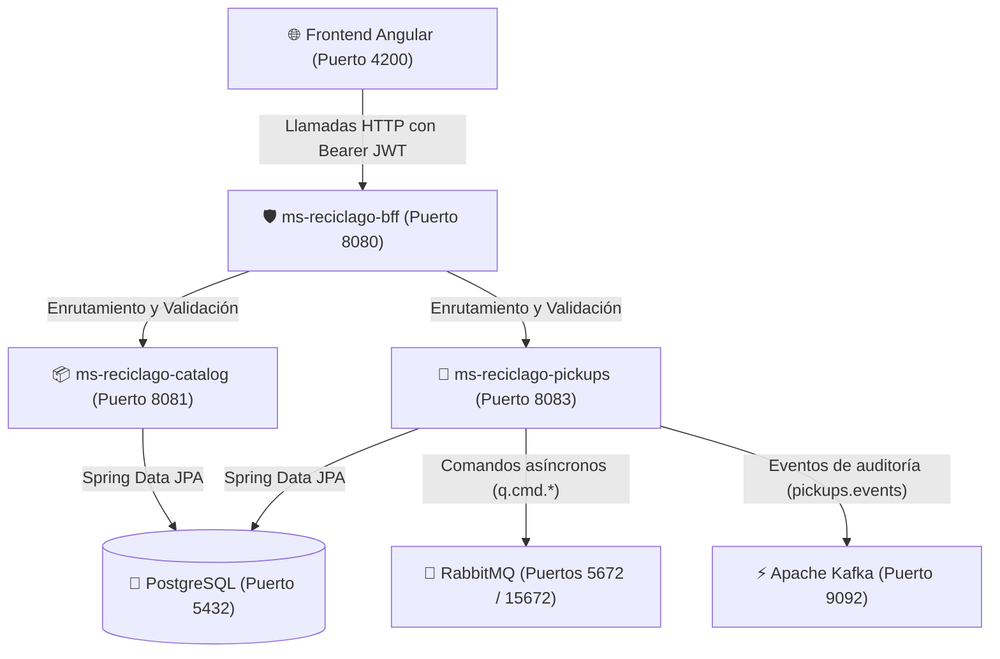

# ♻️ Guía y Explicación Integral del Proyecto: RecicLaGo Cloud Native

Documento de referencia rápida y detallada sobre la arquitectura, estado de avance, infraestructura y guía de ejecución del proyecto **RecicLaGo**.

---

## 📌 1. Visión General y Arquitectura

**RecicLaGo** es una plataforma Cloud Native orientada a la gestión de retiros de reciclaje municipal y domiciliario. Está estructurada bajo el patrón de **microservicios orientados a eventos (EDA - Event-Driven Architecture)**.



---

## 👥 2. División de Roles del Proyecto

| Rol | Módulos a Cargo | Rama Git | Responsabilidades Clave |
| :--- | :--- | :--- | :--- |
| **Desarrollador 1** *(Frontend, BFF y Seguridad)* | `frontend-reciclago`<br>`ms-reciclago-bff` | `feature/dev1-frontend-bff` | • Integración de Azure AD con `@azure/msal-angular`.<br>• Protección de rutas privadas con `MsalGuard`.<br>• BFF en Spring Boot 3 como Resource Server OAuth2.<br>• Mapeo de roles (`ROLE_Admin`, `ROLE_Vecino`). |
| **Desarrollador 2** *(Backend Core, Datos e Infra)* **[TU ROL]** | `docker-compose.yml`<br>`ms-reciclago-catalog`<br>`ms-reciclago-pickups` | `dev2-backend-core` | • Contenedores Docker (Postgres, RabbitMQ, Kafka).<br>• Modelado JPA y CRUDs de Catálogo (Residuos, Camiones, Tarifas).<br>• Ciclo de vida de retiros y emisión de eventos.<br>• Asegurar compatibilidad de compilación en Java 17. |

---

## 🛠️ 3. Resumen de lo que Llevamos Hecho y Resuelto

### 1. Compatibilidad con Java 17 (¡Crítico para evaluación!)
- **Problema:** Los microservicios venían configurados para `Java 21`. En máquinas de laboratorios Duoc con JDK 17/18, `mvn compile` fallaba arrojando `release version 21 not supported`.
- **Solución:** Se ajustaron los archivos `pom.xml` a `<java.version>17</java.version>`. Ambos compilan limpiamente con `BUILD SUCCESS`.

### 2. Infraestructura Base en Docker (`docker-compose.yml`)
- **PostgreSQL 16 (puerto 5432):** Base de datos relacional con base `reciclago_db` y tablas autogeneradas por JPA.
- **RabbitMQ 3.12 (puertos 5672 y 15672):** Broker para colas de mensajería asíncrona (`q.cmd.email`, `q.cmd.route`). Incluye interfaz web de administración.
- **Apache Kafka 7.5 + Zookeeper (puertos 9092 y 2181):** Para el streaming de eventos de dominio en el tópico `pickups.events`.

### 3. Microservicio Catálogo (`ms-reciclago-catalog` - Puerto 8081)
- **Modelos JPA:** `Residuo` (tipos y precios por Kg), `Camion` (patente, capacidad), `Tarifa`.
- **Controladores REST:** Expone endpoints CRUD bajo `/api/catalog/residuos`, `/api/catalog/camiones`, `/api/catalog/tarifas`.
- **Pruebas:** Pruebas unitarias e integración configuradas y ejecutables vía `mvn test`.

### 4. Microservicio Retiros (`ms-reciclago-pickups` - Puerto 8083 / 8082)
- **Ciclo de vida del Retiro:**
  $$\text{SOLICITADO} \longrightarrow \text{PROGRAMADO} \longrightarrow \text{EN\_RUTA} \longrightarrow \text{RETIRADO} \longrightarrow \text{PESADO} \text{ / } \text{CANCELADO}$$
- **Integración RabbitMQ:** Publica comandos al programar o mover a ruta.
- **Integración Kafka:** Publica eventos de auditoría en `pickups.events` ante cualquier cambio de estado.

### 5. Corrección de Arranque en el BFF (`ms-reciclago-bff` - Puerto 8080)
- **Problema:** `spring-boot:run` se caía con `BeanCreationException` en `mvcConversionService` porque `jwtAuthenticationConverter()` tenía la anotación `@Bean` y devolvía una lambda con borrado de tipos genéricos (*type erasure*).
- **Solución:** Se removió la anotación `@Bean` en `SecurityConfig.java`, pasando a método auxiliar privado. El BFF levanta al 100% y protege las rutas con Spring Security.

---

## 🟢 4. Mapa de Puertos y Servicios

| Componente | Tipo | Puerto | URL / Credenciales |
| :--- | :--- | :--- | :--- |
| **PostgreSQL** | Base de Datos | `5432` | `localhost:5432` / user: `postgres`, pass: `postgres123` |
| **RabbitMQ** | Broker AMQP | `5672` | Conexión AMQP interna |
| **RabbitMQ UI** | Panel Web | `15672` | [http://localhost:15672](http://localhost:15672) / user: `reciclago`, pass: `reciclago123` |
| **Kafka Broker** | Event Streaming | `9092` | `localhost:9092` |
| **Zookeeper** | Coordinador Kafka | `2181` | `localhost:2181` |
| **BFF** | Spring Boot | `8080` | [http://localhost:8080/public/status](http://localhost:8080/public/status) |
| **Catálogo** | Spring Boot | `8081` | [http://localhost:8081/api/catalog/residuos](http://localhost:8081/api/catalog/residuos) |
| **Retiros** | Spring Boot | `8083` | [http://localhost:8083/api/pickups](http://localhost:8083/api/pickups) |
| **Frontend** | Angular | `4200` | [http://localhost:4200](http://localhost:4200) |

---

## 🚀 5. Guía de Ejecución Paso a Paso

Si reinicias tu computador o abres una nueva sesión, sigue estos pasos en orden:

### Paso 1: Levantar Contenedores Docker
Abre una terminal PowerShell en la raíz del proyecto (`c:\Users\CETECOM\Downloads\reciclago-cloud-nativo`):
```powershell
docker compose up -d postgres rabbitmq kafka
```
*(Para verificar que estén corriendo con salud: `docker ps`)*.

---

### Paso 2: Ejecutar los Microservicios Backend
Abre una ventana/pestaña de terminal para cada servicio:

- **Terminal 1 — Microservicio Catálogo (Puerto 8081):**
  ```powershell
  cd ms-reciclago-catalog
  .\mvnw.cmd spring-boot:run
  ```

- **Terminal 2 — Microservicio Retiros (Puerto 8083):**
  ```powershell
  cd ms-reciclago-pickups
  .\mvnw.cmd spring-boot:run "-Dspring-boot.run.arguments=--server.port=8083"
  ```
  *(Nota: Usamos el puerto 8083 ya que el 8082 suele estar reservado por servicios del sistema Windows).*

- **Terminal 3 — Microservicio BFF (Puerto 8080):**
  ```powershell
  cd ms-reciclago-bff
  .\mvnw.cmd spring-boot:run
  ```

---

### Paso 3: Ejecutar el Frontend Angular (Opcional)
- **Terminal 4 — Frontend (Puerto 4200):**
  ```powershell
  cd frontend-reciclago
  npm start
  ```

---

## 🧪 6. Comandos para Probar y Demostrar el Sistema

Puedes abrir una consola y correr estos comandos para validar el correcto funcionamiento:

### 1. Probar BFF (Puerto 8080)
- **Endpoint público (sin autenticación requerida):**
  ```powershell
  curl http://localhost:8080/public/status
  ```
  *Respuesta esperada:* `{"security":"Public endpoint","service":"ms-reciclago-bff","status":"UP"}`

- **Endpoint protegido (valida que la seguridad funciona rechazando peticiones sin token):**
  ```powershell
  curl -i http://localhost:8080/api/pickups/summary
  ```
  *Respuesta esperada:* `HTTP/1.1 401 Unauthorized`

### 2. Probar Catálogo de Residuos (Puerto 8081)
- **Listar residuos registrados:**
  ```powershell
  curl http://localhost:8081/api/catalog/residuos
  ```
- **Listar camiones de reciclaje:**
  ```powershell
  curl http://localhost:8081/api/catalog/camiones
  ```

### 3. Probar Servicio de Retiros (Puerto 8083)
- **Listar retiros solicitados y programados:**
  ```powershell
  curl http://localhost:8083/api/pickups
  ```
- **Consultar un retiro por ID (ejemplo ID 1):**
  ```powershell
  curl http://localhost:8083/api/pickups/1
  ```

---

## 🌿 7. Buenas Prácticas de Git y Commits

Actualmente estás en la rama **`dev2-backend-core`**.

Al hacer cambios, utiliza el formato de **Conventional Commits**:
- `feat(catalog): agregar nuevo campo en entidad Residuo`
- `fix(pickups): correccion en calculo de tarifa al pesar`
- `test(catalog): agregar prueba unitaria para TarifaController`
- `docs: actualizar documentacion de ejecucion`
