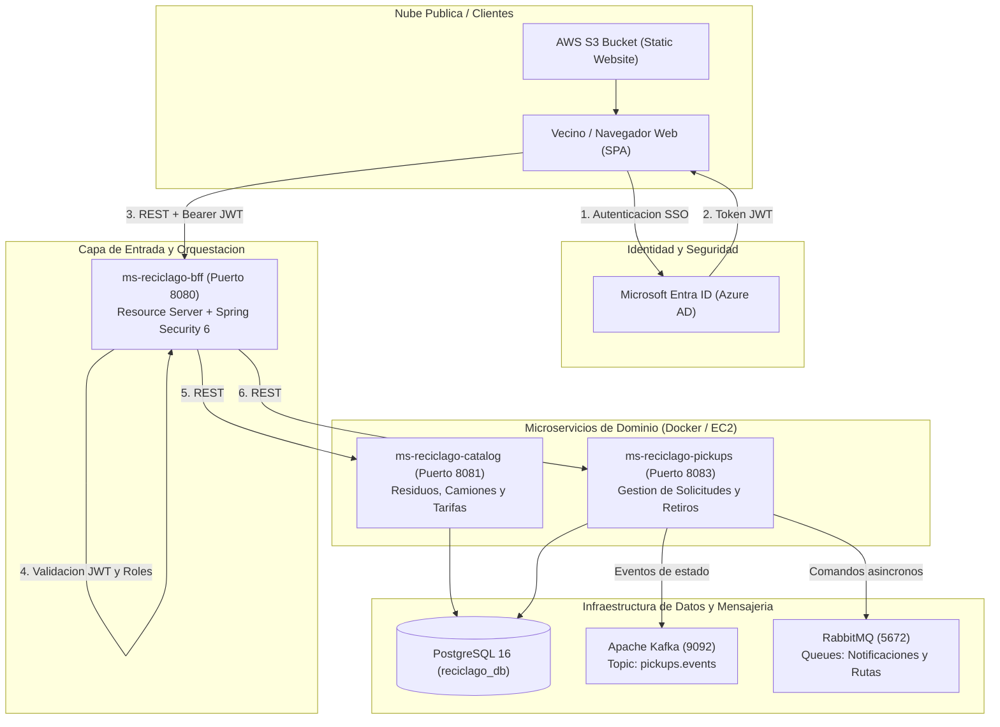
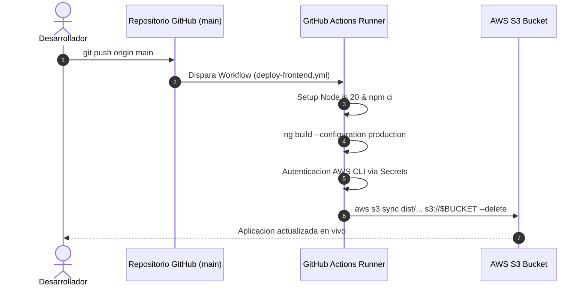
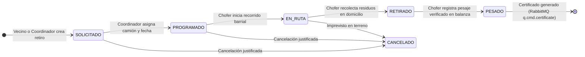

# RecicLaGo - Plataforma Cloud Native Municipal
> **Sistema de Gestion y Trazabilidad de Residuos Domiciliarios Puerta a Puerta**  
> *Ilustre Municipalidad de Puerto Varas - Cuenca Protegida del Lago Llanquihue*  
> **Asignatura:** Cloud Nativo (DSY1107) - Duoc UC

[](https://angular.dev/)
[](https://spring.io/projects/spring-boot)
[](https://www.oracle.com/java/)
[](https://kafka.apache.org/)
[](https://www.rabbitmq.com/)
[](https://www.postgresql.org/)
[](https://aws.amazon.com/s3/)
[](https://learn.microsoft.com/entra/)

**Frontend Desplegado en Produccion (AWS S3 HTTPS):**  
[https://reciclago-frontend-puertovaras.s3.us-east-1.amazonaws.com/index.html](https://reciclago-frontend-puertovaras.s3.us-east-1.amazonaws.com/index.html)

---

## 1. Vision y Contexto del Proyecto

La comuna de **Puerto Varas** enfrenta un desafio medioambiental critico: el crecimiento demografico y turistico ha saturado la logistica de recoleccion tradicional de basura, incrementando los costos municipales de disposicion final y generando riesgos en el ecosistema de la cuenca del Lago Llanquihue.

**RecicLaGo** surge como la solucion tecnologica municipal para implementar la **Ley REP (Responsabilidad Extendida del Productor)** mediante una arquitectura desacoplada en la nube que permite:
- Programar y solicitar retiros diferenciados de residuos reciclables puerta a puerta.
- Optimizar rutas de camiones recolectores por cuadrantes comunales.
- Registrar pesajes in situ y certificar la huella de carbono mitigada.
- Brindar trazabilidad vecinal en tiempo real mediante notificaciones y eventos asincronos.

---

## 2. Arquitectura del Sistema (Cloud Native & EDA)

El sistema implementa el patron **Backend for Frontend (BFF)** combinado con una **Arquitectura Orientada a Eventos (EDA)** y microservicios autonomos comunicados mediante mensajeria reactiva.



---

## 3. Microservicios y Componentes

| Servicio | Puerto | Tecnología | Rol Principal |
|---|:---:|---|---|
| **frontend-reciclago** | 4200 / S3 | Angular 18 + Tailwind CSS + MSAL | Portal vecinal y operativo con dashboards especializados para los 4 roles comunales, tracking en tiempo real y solicitud de retiros. |
| **ms-reciclago-bff** | 8080 | Spring Boot 3 + Spring Security 6 | Backend for Frontend (API Gateway). Resource Server OAuth2, validación de emisor, audiencia y firma JWT, control RBAC y proxy resiliente hacia microservicios. |
| **ms-reciclago-catalog** | 8081 | Spring Boot 3 + Spring Data JPA | Catálogo de tipos de residuos (vidrio, plástico, cartón, metales), flota de camiones municipales y parametrización de capacidades. |
| **ms-reciclago-pickups** | 8083 | Spring Boot 3 + Spring Data JPA | Ciclo de vida logístico de retiros (`SOLICITADO` ➔ `PROGRAMADO` ➔ `EN_RUTA` ➔ `RETIRADO` ➔ `PESADO`), publicador en Kafka y RabbitMQ. |
| **ms-reciclago-routes** | 8084 | Spring Boot 3 + Spring Data JPA | Gestión de cuadrantes barriales comunales (Puerto Chico, Costanera, Ensenada, Nueva Braunau), simulación GPS y tracking ciudadano. |

---

## 4. Seguridad, Autenticación y Cuentas de Prueba (RBAC)

La solución utiliza autenticación federada mediante **OAuth2 y OpenID Connect** con **Microsoft Entra ID (Azure AD)** implementando una **arquitectura de doble aplicación (Double App Registration)**:

### Matriz de Roles y Cuentas de Prueba Oficiales

Para probar el flujo completo en local (`http://localhost:4200`) o producción, se han aprovisionado las siguientes credenciales en el Tenant de Microsoft Entra ID:

| Rol | Correo de Prueba (Entra ID) | Permisos en BFF | Vista en Frontend |
|---|---|---|---|
| **Administrador** | `admin@reciclago.onmicrosoft.com` | `ROLE_Admin` | Dashboard integral DIMAO, auditoría Kafka, gestión de flota, exportación CSV y control total del ciclo de vida. |
| **Coordinador** | `coordinador@reciclago.onmicrosoft.com` | `ROLE_Coordinador` | Dashboard de despacho logístico, recepción de avisos barriales, programación de retiros y asignación de camiones. |
| **Chofer** | `chofer@reciclago.onmicrosoft.com` | `ROLE_Chofer` | Dashboard operativo de ruta, inicio de viaje (`EN_RUTA`), confirmación de recolección (`RETIRADO`) y registro de pesaje real (`PESADO`). |
| **Vecino** | `jon.vidals@duocuc.cl`<br>*(o cualquier cuenta Microsoft/Duoc)* | `ROLE_Vecino` *(por defecto)* | Portal ciudadano: consulta de cuadrantes/días de recolección, solicitud de retiro particular, tracking de camión barrial e historial personal aislado (BOLA/IDOR safe). |

- **Tenant ID (RecicLaGo):** `5625266d-cae0-4070-a7ea-b5e88273580f`
- **Client ID Backend (API):** `9a946a0b-5350-4fe1-a79e-ca332612f60d`
- **Client ID Frontend (SPA):** `20ae8f6f-ef82-48a6-a4ae-897d36212b4b`
- **Scope Autorizado:** `api://9a946a0b-5350-4fe1-a79e-ca332612f60d/access_as_user`

---

## 5. DevOps, CI/CD y Despliegue en AWS Cloud

El proyecto incorpora un pipeline de Integracion y Entrega Continua (**CI/CD**) mediante **GitHub Actions**:



- **Workflow de despliegue:** [deploy-frontend.yml](file:///.github/workflows/deploy-frontend.yml)
- **Alojamiento estatico:** AWS S3 Bucket con enrutamiento de errores configurado a `index.html` para soporte de Angular SPA.
- **Microservicios Backend:** Empaquetados en imagenes Docker, versionados en **AWS ECR** y desplegados sobre instancias **AWS EC2**.

---

## 5. Cómo Funciona la Aplicación (Ciclo End-to-End y Arquitectura Cloud Native)

RecicLaGo opera bajo un flujo logístico colaborativo en tiempo real que conecta al vecino de Puerto Varas con la Dirección de Medio Ambiente (DIMAO) y el personal operativo en terreno:



### Flujo Operativo por Rol:

1. **🧑‍🌾 Ciudadano / Vecino (`ROLE_Vecino`)**:
   - Ingresa con su cuenta institucional o personal (`jon.vidals@duocuc.cl`).
   - Consulta el calendario comunal de recolección y el mapa de su cuadrante barrial (Costanera, Puerto Chico, Ensenada o Nueva Braunau).
   - Registra una **Solicitud de Retiro Puerta a Puerta** indicando tipo de material (vidrio, cartón, plástico, metales), peso estimado y observaciones.
   - Estado inicial: `SOLICITADO`. Su historial personal permanece protegido contra accesos indebidos (BOLA/IDOR safe).

2. **📋 Coordinador Logístico DIMAO (`ROLE_Coordinador`)**:
   - Ingresa con `coordinador@reciclago.onmicrosoft.com`.
   - Visualiza en tiempo real las solicitudes comunales en estado `SOLICITADO`.
   - Abre el modal de operación, selecciona un camión recolector disponible del catálogo municipal (`ms-catalog`), define fecha y hora de recogida y confirma la operación.
   - El estado pasa a `PROGRAMADO`. Automáticamente se emiten eventos a **RabbitMQ** (`q.cmd.email`, `q.cmd.route`) y **Kafka** (`pickups.events`).

3. **🚛 Chofer / Conductor Operativo (`ROLE_Chofer`)**:
   - Ingresa con `chofer@reciclago.onmicrosoft.com`.
   - Visualiza los retiros programados asignados a su camión y cuadrante.
   - Al comenzar el viaje, presiona **Iniciar Ruta** (estado ➔ `EN_RUTA`).
   - Al llegar al domicilio del vecino, recolecta el material y presiona **Marcar Retirado** (estado ➔ `RETIRADO`).
   - Pesa el residuo en la balanza municipal e ingresa los kilogramos reales verificados (estado ➔ `PESADO`). Se emite un comando asíncrono a RabbitMQ (`q.cmd.certificate`).

4. **🏛️ Administrador Comunal (`ROLE_Admin`)**:
   - Ingresa con `admin@reciclago.onmicrosoft.com`.
   - Supervisa el cumplimiento de metas comunales de reciclaje de la Ley REP, kilogramos recuperados y CO₂ mitigado.
   - Monitorea la disponibilidad de la flota y el estado de cuadrantes.
   - Audita en vivo los eventos de trazabilidad publicados en Kafka (`audit.timeline`).
   - Exporta reportes consolidados y tiene facultades para reprogramar o cancelar operaciones.

---

## 6. Instalación y Ejecución en Entorno Local (Docker Desktop)

Todos los componentes de backend están dockerizados e integrados en una sola red virtual (`reciclago-net`).

### Prerrequisitos
- **Docker Desktop** (con soporte WSL2 en Windows o Docker Engine en Linux/macOS).
- **Node.js 20+** y `npm`.
- **Git**.

### Paso 1: Levantar Todo el Backend en Docker Desktop
Desde la raíz del repositorio:
```bash
docker compose up -d
```
Este único comando descargará/construirá y levantará los **8 contenedores** de la solución en segundo plano:

| Contenedor | Puerto Host | Descripción |
|---|---|---|
| `reciclago-ms-bff` | `8080` | API Gateway BFF (Spring Security OAuth2 + RBAC) |
| `reciclago-ms-pickups` | `8083` | Microservicio de Retiros y Ciclo de Vida |
| `reciclago-ms-catalog` | `8081` | Microservicio de Catálogo de Flotas y Residuos |
| `reciclago-ms-routes` | `8084` | Microservicio de Cuadrantes y Tracking Barrial |
| `reciclago-postgres` | `5433` | Base de datos PostgreSQL (`reciclago_db`) |
| `reciclago-rabbitmq` | `5672` / `15672` | Broker AMQP + Consola Web (`guest` / `guest`) |
| `reciclago-kafka` | `9092` / `29092` | Broker de Event Streaming |
| `reciclago-zookeeper` | `2181` | Coordinador de Clúster Kafka |

> [!TIP]
> Puedes abrir **Docker Desktop** y verás el proyecto `reciclago` con sus 8 contenedores en estado *Running* y saludables (*Healthy*).

### Paso 2: Iniciar el Frontend Angular
En una terminal:
```bash
cd frontend-reciclago
npm install
npm start
```
El portal estará disponible en `http://localhost:4200`.

---

## 7. División de Responsabilidades: ¿Qué Pega le Queda a DEV 2?

### Resumen del Trabajo Realizado por DEV 1 (Frontend + BFF):
- ✅ Frontend Angular 18 multi-rol modularizado ([`AdminDashboardComponent`](file:///c:/Users/krosa/Desktop/semestre%206/cloud%20nativo/reciclago/frontend-reciclago/src/app/pages/dashboard/components/admin-dashboard.component.ts), [`CoordinadorDashboardComponent`](file:///c:/Users/krosa/Desktop/semestre%206/cloud%20nativo/reciclago/frontend-reciclago/src/app/pages/dashboard/components/coordinador-dashboard.component.ts), [`ChoferDashboardComponent`](file:///c:/Users/krosa/Desktop/semestre%206/cloud%20nativo/reciclago/frontend-reciclago/src/app/pages/dashboard/components/chofer-dashboard.component.ts) y vista de Vecino).
- ✅ Integración federada Microsoft Entra ID (SSO, PKCE, validación JWT, extracción resiliente de identidad y control RBAC).
- ✅ Reemplazo de browser alerts bloqueantes por banners modales integrados.
- ✅ Configuración de `JdkClientHttpRequestFactory` en BFF para soporte nativo de HTTP `PATCH`.
- ✅ Dockerización completa de los 4 microservicios por defecto en `docker-compose.yml` (resolviendo la directiva oculta `profiles: ['apps']`).
- ✅ Pipeline CI/CD a AWS S3 Bucket ([deploy-frontend.yml](file:///.github/workflows/deploy-frontend.yml)).

---

### Checklist de Tareas Pendientes para DEV 2 (Backend Core + Nube AWS):

De acuerdo a la rúbrica de evaluación y la arquitectura distribuida del proyecto, las responsabilidades pendientes de **DEV 2** son:

```
[ ] 1. Despliegue del Backend en AWS Cloud (ECR + EC2) — CRÍTICO:
    - Autenticarse en AWS con sus propias credenciales de Learner Lab / Academy (separadas de DEV 1).
    - Ejecutar el script `scripts/deploy-backend.ps1` para compilar y subir las imágenes Docker a AWS ECR:
      * reciclago/ms-bff
      * reciclago/ms-catalog
      * reciclago/ms-pickups
      * reciclago/ms-routes
    - Aprovisionar una instancia EC2 (Ubuntu/Amazon Linux con Docker y Docker Compose).
    - Clonar o transferir el `docker-compose.yml` a la instancia EC2 y levantar el stack productivo (`docker compose up -d`).
    - Configurar los Security Groups de la instancia EC2 para permitir tráfico de entrada en el puerto 8080 (BFF).

[ ] 2. Consumidores / Workers Asíncronos de RabbitMQ — IMPORTANTE:
    - El microservicio `ms-reciclago-pickups` ya emite correctamente mensajes a las colas:
      * `q.cmd.email`: Eventos de notificación por email al cambiar de estado.
      * `q.cmd.certificate`: Evento emitido al completar el pesaje (`PESADO`) con datos del vecino, peso y fecha.
    - DEV 2 debe implementar o verificar los consumidores (@RabbitListener) que procesen estas colas:
      * Worker simulador de envío de correos (imprimir log o integrar servicio de correo).
      * Worker generador de certificado PDF de reciclaje y mitigación de huella de carbono.

[ ] 3. Consumidor de Auditoría en Apache Kafka (`audit.timeline`) — IMPORTANTE:
    - El servicio emite los eventos `PickupStateChangeEventDto` a los tópicos `pickups.events` y `audit.timeline`.
    - DEV 2 puede implementar o verificar un @KafkaListener de auditoría que persista o procese esta línea de tiempo para consultas de DIMAO.

[ ] 4. Pruebas de Carga y Resiliencia en Nube — RECOMENDADO:
    - Verificar la tolerancia a fallos en la instancia EC2 (reinicio automático de contenedores con `restart: unless-stopped`).
```

---

## 8. Verificación de Seguridad y Rutas con cURL (Rúbrica EP2 - Indicador 8)

A continuación se presentan los comandos formales de prueba mediante cURL para demostrar el comportamiento del Resource Server BFF frente a diferentes escenarios de autenticación y autorización (códigos HTTP 200, 401 y 403):

### 1. Acceso a Rutas Públicas (Sin Token) -> `200 OK`
```bash
# Verificación de estado del BFF
curl -i http://localhost:8080/public/status

# Healthcheck de Actuator
curl -i http://localhost:8080/actuator/health
```
**Respuesta esperada:** `HTTP/1.1 200 OK` con JSON `{"status":"ONLINE","gateway":"ms-reciclago-bff"}`.

### 2. Petición a Ruta Protegida sin Token -> `401 Unauthorized`
```bash
curl -i http://localhost:8080/api/me
```
**Respuesta esperada:** `HTTP/1.1 401 Unauthorized` con payload RFC 7807:
```json
{
  "timestamp": 1725904800000,
  "status": 401,
  "error": "Unauthorized",
  "message": "Full authentication is required to access this resource",
  "path": "/api/me"
}
```

### 3. Petición con Token de Vecino a Endpoint Administrativo -> `403 Forbidden`
```bash
# Presentando Bearer token emitido para usuario con rol "ROLE_Vecino"
curl -i -H "Authorization: Bearer <TOKEN_VECINO>" http://localhost:8080/api/admin/dashboard
```
**Respuesta esperada:** `HTTP/1.1 403 Forbidden`:
```json
{
  "timestamp": 1725904800000,
  "status": 403,
  "error": "Forbidden",
  "message": "Access Denied: Insufficient Role Permissions",
  "path": "/api/admin/dashboard"
}
```

### 4. Petición con Token de Vecino a Rutas Propias -> `200 OK`
```bash
# Perfil del usuario autenticado
curl -i -H "Authorization: Bearer <TOKEN_VECINO>" http://localhost:8080/api/me

# Catálogo comunal de residuos
curl -i -H "Authorization: Bearer <TOKEN_VECINO>" http://localhost:8080/api/catalog/residuos

# Historial de retiros (Filtrado automáticamente por el BFF a su propio email)
curl -i -H "Authorization: Bearer <TOKEN_VECINO>" http://localhost:8080/api/pickups
```
**Respuesta esperada:** `HTTP/1.1 200 OK`.

### 5. Control de Acceso RBAC en Ciclo de Vida Logístico
```bash
# Intento de programar camión por un usuario 'Vecino' -> 403 Forbidden
curl -i -X PATCH -H "Authorization: Bearer <TOKEN_VECINO>" \
  http://localhost:8080/api/pickups/1/programar

# Ejecución por usuario con rol 'Admin' o 'Coordinador' -> 200 OK
curl -i -X PATCH -H "Authorization: Bearer <TOKEN_ADMIN>" \
  "http://localhost:8080/api/pickups/1/programar?camionId=1&camionPatente=PV-RC-2026&fechaProgramada=2026-09-12T09:00:00"
```

---

## 9. Estructura del Repositorio

```text
reciclago/
├── .github/
│   └── workflows/
│       └── deploy-frontend.yml       # Pipeline CI/CD automático GitHub -> AWS S3
├── docker-compose.yml                # Infraestructura completa Docker Desktop (8 contenedores)
├── ruta_trabajo.md                   # Bitácora técnica y guía detallada DEV 1 / DEV 2
├── ms-reciclago-bff/                 # Backend for Frontend (Spring Security OAuth2 + Dockerfile)
├── ms-reciclago-catalog/             # Microservicio de Catálogo (Residuos, Camiones, Tarifas)
├── ms-reciclago-pickups/             # Microservicio de Retiros (Eventos Kafka / RabbitMQ)
├── ms-reciclago-routes/              # Microservicio de Rutas y Ciudadanía (Cuadrantes, DIMAO, GPS)
└── frontend-reciclago/               # Portal Web Angular 18
    ├── src/
    │   ├── app/
    │   │   ├── guards/               # AuthGuard (Microsoft Entra ID)
    │   │   ├── pages/
    │   │   │   ├── home/             # Landing page institucional comunal
    │   │   │   ├── login/            # Pantalla de acceso SSO Microsoft
    │   │   │   └── dashboard/        # Dashboards especializados (Admin, Coord, Chofer, Vecino)
    │   │   ├── services/             # BffService (Comunicación REST reactiva)
    │   │   ├── app.component.ts      # Header universal, menú móvil fluido y modales
    │   │   ├── app.config.ts         # Configuración MSAL y Providers Angular
    │   │   └── app.routes.ts         # Enrutador cliente SPA (HashLocationStrategy)
    │   └── assets/                   # Fotografías 4K, favicon y escudos oficiales
    └── tailwind.config.js            # Sistema de diseño comunal Puerto Varas
```

---

## 10. Cumplimiento Académico (Caso 7 & Pautas DSY1107)

El proyecto da cumplimiento íntegro a los requisitos solicitados en la asignatura **Cloud Nativo**:

- **Caso 7 (RecicLaGo Puerto Varas)**: Cobertura de trazabilidad de reciclaje puerta a puerta, sectores y cuadrantes comunales, categorización oficial de residuos (vidrio, cartón, plástico, latas) y pesaje in situ.
- **Encargo EP1 (60% Frontend + 40% BFF)**: Autenticación federada MSAL en Angular, intercepción de peticiones con Bearer JWT, validación de claims y control RBAC en Spring Security.
- **Encargo EP2 (Cloud Nativo y Presentación)**: Despliegue en nube pública AWS, pipeline CI/CD, contenedorización Docker, comunicación asíncrona mediante Kafka y RabbitMQ, y alta disponibilidad con arquitectura SPA desacoplada.

---

**Municipalidad de Puerto Varas** - *DIMAO (Direccion de Medio Ambiente, Aseo y Ornato)*  
*Cuenca del Lago Llanquihue, Region de Los Lagos, Chile.*
