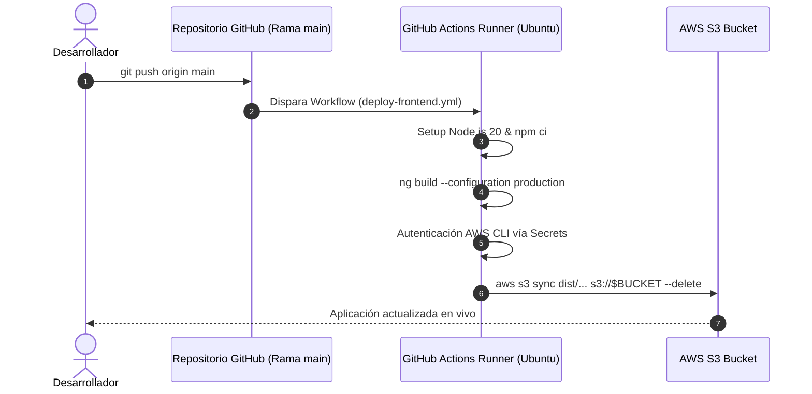

# ♻️ RecicLaGo — Plataforma Cloud Native Municipal
> **Sistema Inteligente de Gestión y Trazabilidad de Residuos Domiciliarios Puerta a Puerta**  
> *Ilustre Municipalidad de Puerto Varas • Cuenca Protegida del Lago Llanquihue*  
> **Asignatura:** Cloud Nativo (DSY1107) — Duoc UC

[](https://angular.dev/)
[](https://spring.io/projects/spring-boot)
[](https://www.oracle.com/java/)
[](https://kafka.apache.org/)
[](https://www.rabbitmq.com/)
[](https://www.postgresql.org/)
[](https://aws.amazon.com/s3/)
[](https://learn.microsoft.com/entra/)

🌐 **Frontend Desplegado en Producción (AWS S3):**  
👉 **[http://reciclago-frontend-puertovaras.s3-website-us-east-1.amazonaws.com](http://reciclago-frontend-puertovaras.s3-website-us-east-1.amazonaws.com)**

---

## 📌 1. Visión y Contexto del Proyecto

La comuna de **Puerto Varas** enfrenta un desafío medioambiental crítico: el crecimiento demográfico y turístico ha saturado la logística de recolección tradicional de basura, incrementando los costos municipales de disposición final y generando riesgos en el ecosistema de la cuenca del Lago Llanquihue.

**RecicLaGo** surge como la solución tecnológica municipal para implementar la **Ley REP (Responsabilidad Extendida del Productor)** mediante una arquitectura moderna desacoplada en la nube que permite:
- Programar y solicitar retiros diferenciados de residuos reciclables puerta a puerta.
- Optimizar rutas de camiones recolectores por cuadrantes comunales.
- Registrar pesajes in situ y certificar la huella de carbono mitigada.
- Brindar trazabilidad vecinal en tiempo real mediante notificaciones y eventos asíncronos.

---

## 🏛️ 2. Arquitectura del Sistema (Cloud Native & EDA)

El sistema implementa el patrón **Backend for Frontend (BFF)** combinado con una **Arquitectura Orientada a Eventos (EDA)** y microservicios autónomos comunicados mediante mensajería reactiva.

```mermaid
flowchart TD
    subgraph "Nube Pública / Clientes"
        Browser["💻 Vecino / Navegador Web<br>Single Page Application"]
        S3["🪣 AWS S3 Bucket<br>Static Website Hosting"]
    end

    subgraph "Identidad & Seguridad"
        Entra["🔐 Microsoft Entra ID (Azure AD)<br>OAuth2 / OIDC Authorization Server"]
    end

    subgraph "Capa de Entrada & Orquestación"
        BFF["🛡️ ms-reciclago-bff (Puerto 8080)<br>Resource Server + Spring Security 6<br>Validación Criptográfica JWT"]
    end

    subgraph "Microservicios de Dominio (Docker / EC2)"
        Catalog["📦 ms-reciclago-catalog (Puerto 8081)<br>Residuos, Camiones y Tarifas"]
        Pickups["🚛 ms-reciclago-pickups (Puerto 8083)<br>Gestión de Solicitudes y Retiros"]
    end

    subgraph "Infraestructura de Datos y Mensajería"
        Postgres[("🐘 PostgreSQL 16<br>reciclago_db")]
        Kafka["⚡ Apache Kafka (9092)<br>Topic: pickups.events (Trazabilidad)"]
        RabbitMQ["🐇 RabbitMQ (5672)<br>Queues: Notificaciones & Rutas"]
    end

    S3 --> Browser
    Browser -->|"1. Autenticación SSO"| Entra
    Entra -->>|"2. Token JWT"| Browser
    Browser -->|"3. HTTP REST + Bearer JWT"| BFF
    BFF -->|"4. Mapeo de Roles & Scopes"| BFF
    BFF -->|"5. HTTP REST"| Catalog
    BFF -->|"6. HTTP REST"| Pickups
    Catalog --> Postgres
    Pickups --> Postgres
    Pickups -->|"Eventos de Estado"| Kafka
    Pickups -->|"Comandos Asíncronos"| RabbitMQ
```

---

## 🧩 3. Microservicios y Componentes

| Servicio | Puerto | Tecnología | Rol Principal |
|---|:---:|---|---|
| **`frontend-reciclago`** | 4200 (Local) / S3 | Angular 18 + Tailwind CSS + MSAL | Portal vecinal responsive con diseño cívico institucional, mapa de cuadrantes, calendario y solicitud de retiros. |
| **`ms-reciclago-bff`** | 8080 | Spring Boot 3 + Spring Security | Backend for Frontend. Resource Server OAuth2, validación de emisor/audiencia/firma JWT, control de acceso por roles (RBAC) y proxy hacia microservicios internos. |
| **`ms-reciclago-catalog`** | 8081 | Spring Boot 3 + Spring Data JPA | Catálogo de tipos de residuos (papel, vidrio, plástico, metales), flota municipal de camiones y parametrización de capacidades. |
| **`ms-reciclago-pickups`** | 8083 | Spring Boot 3 + Spring Cloud Streams | Ciclo de vida de las solicitudes de retiro (`SOLICITADO` ➔ `EN_RUTA` ➔ `RECOLECTADO` ➔ `PESADO` ➔ `CERTIFICADO`), publicador en Kafka y RabbitMQ. |

---

## 🔐 4. Seguridad, Autenticación y Autorización (RBAC)

La solución utiliza autenticación federada mediante **OAuth2 y OpenID Connect** con **Microsoft Entra ID (Azure AD)**:

1. **Flujo PKCE en el Frontend**: El cliente Angular implementa `@azure/msal-browser` v5 y `@azure/msal-angular` v6 mediante `PublicClientApplication`.
2. **Protección de Rutas**: Los guards [`auth.guard.ts`](file:///c:/Users/krosa/Desktop/semestre%206/cloud%20nativo/reciclago/frontend-reciclago/src/app/guards/auth.guard.ts) aseguran que ninguna ruta privada (como `/dashboard`, `/pickups`, `/catalog`) sea accesible sin una sesión válida.
3. **Validación en el BFF**: El microservicio BFF valida rigurosamente la firma criptográfica con la clave pública del tenant municipal (`login.microsoftonline.com`), verificando vigencia temporal (`exp`) y audiencia (`aud`).
4. **Matriz de Roles (RBAC)**:
   - `ROLE_Vecino`: Consulta de rutas, solicitud de retiro domiciliario, historial personal.
   - `ROLE_Coordinador`: Asignación de cuadrantes, monitoreo de camiones, validación de pesaje.
   - `ROLE_Admin`: Configuración global, reportes consolidados DIMAO y auditoría comunal.

---

## 🚀 5. DevOps, CI/CD y Despliegue en AWS Cloud

El proyecto incorpora un pipeline completo de Integración y Entrega Continua (**CI/CD**) mediante **GitHub Actions**:



- **Workflow de despliegue:** [`.github/workflows/deploy-frontend.yml`](file:///.github/workflows/deploy-frontend.yml)
- **Alojamiento estático:** AWS S3 Bucket con enrutamiento de errores configurado a `index.html` para soporte de Angular SPA.
- **Microservicios Backend:** Empaquetados en imágenes Docker, versionados en **AWS ECR** y desplegados sobre instancias **AWS EC2**.

---

## 💻 6. Instalación y Ejecución en Entorno Local

### Prerrequisitos
- **Java 17 JDK** instalado y configurado en `PATH`.
- **Node.js 20+** y `npm`.
- **Docker** y **Docker Compose**.
- **Git**.

### Paso 1: Levantar Infraestructura de Mensajería y Base de Datos
Desde la raíz del proyecto:
```bash
docker compose up -d
```
Esto inicializará:
- PostgreSQL 16 en el puerto `5432` (`reciclago_db`)
- RabbitMQ en los puertos `5672` (AMQP) y `15672` (Consola Web: user `guest`, pass `guest`)
- Apache Kafka en el puerto `9092` con Zookeeper en `2181`

### Paso 2: Iniciar Microservicios Backend

1. **Iniciar ms-reciclago-catalog:**
```bash
cd ms-reciclago-catalog
./mvnw spring-boot:run
```

2. **Iniciar ms-reciclago-pickups:**
```bash
cd ../ms-reciclago-pickups
./mvnw spring-boot:run
```

3. **Iniciar ms-reciclago-bff:**
```bash
cd ../ms-reciclago-bff
./mvnw spring-boot:run
```

### Paso 3: Iniciar Frontend Angular
```bash
cd ../frontend-reciclago
npm install
npm start
```
El portal estará disponible localmente en `http://localhost:4200`.

---

## 📂 7. Estructura del Repositorio

```text
reciclago/
├── .github/
│   └── workflows/
│       └── deploy-frontend.yml       # Pipeline CI/CD automático GitHub -> AWS S3
├── docker-compose.yml                # Infraestructura local (Postgres, RabbitMQ, Kafka)
├── ruta_trabajo.md                   # Bitácora técnica y guía detallada DEV 1 / DEV 2
├── ms-reciclago-bff/                 # Backend for Frontend (Spring Security OAuth2)
├── ms-reciclago-catalog/             # Microservicio de Catálogo (Residuos, Camiones, Tarifas)
├── ms-reciclago-pickups/             # Microservicio de Retiros (Eventos Kafka / RabbitMQ)
└── frontend-reciclago/               # Portal Web Angular 18
    ├── src/
    │   ├── app/
    │   │   ├── guards/               # AuthGuard (Microsoft Entra ID)
    │   │   ├── pages/
    │   │   │   ├── home/             # Landing page institucional comunal
    │   │   │   ├── login/            # Pantalla de acceso SSO Microsoft
    │   │   │   └── dashboard/        # Panel vecinal, solicitud y cuadrantes
    │   │   ├── services/             # BffService (Comunicación REST reactiva)
    │   │   ├── app.component.ts      # Header universal, modales y footer cívico
    │   │   ├── app.config.ts         # Configuración MSAL y Providers Angular
    │   │   └── app.routes.ts         # Enrutador cliente SPA
    │   └── assets/                   # Fotografías 4K, favicon y escudos oficiales
    └── tailwind.config.js            # Sistema de diseño comunal Puerto Varas
```

---

## 📋 8. Cumplimiento Académico (Caso 7 & Pautas DSY1107)

El proyecto da cumplimiento íntegro a los requisitos solicitados en la asignatura **Cloud Nativo**:

- ✅ **Caso 7 (RecicLaGo Puerto Varas)**: Cobertura de trazabilidad de reciclaje puerta a puerta, sectores y cuadrantes comunales, categorización oficial de residuos (vidrio, cartón, plástico, latas) y pesaje in situ.
- ✅ **Encargo EP1 (60% Frontend + 40% BFF)**: Autenticación federada MSAL en Angular, intercepción de peticiones con Bearer JWT, validación de claims y control RBAC en Spring Security.
- ✅ **Encargo EP2 (Cloud Nativo & Presentación)**: Despliegue en nube pública AWS, pipeline CI/CD, contenedorización Docker, comunicación asíncrona mediante Kafka y RabbitMQ, y alta disponibilidad con arquitectura SPA desacoplada.

---

**Municipalidad de Puerto Varas** • *DIMAO (Dirección de Medio Ambiente, Aseo y Ornato)*  
*Cuenca del Lago Llanquihue, Región de Los Lagos, Chile.*
