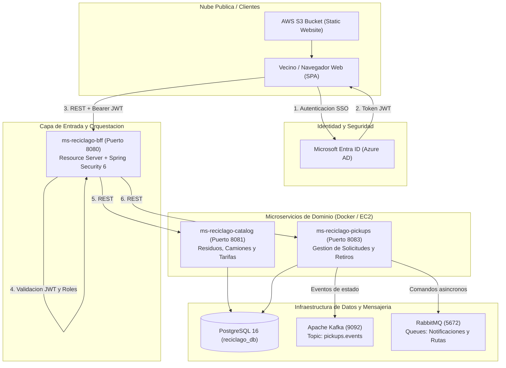
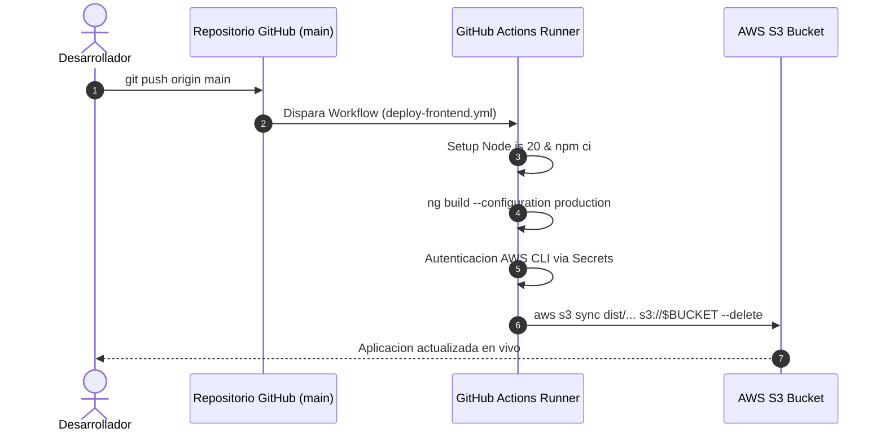

# RecicLaGo - Plataforma Cloud Native Municipal
> **Sistema de Gestion y Trazabilidad de Residuos Domiciliarios Puerta a Puerta**  
> *Ilustre Municipalidad de Puerto Varas - Cuenca Protegida del Lago Llanquihue*  
> **Asignatura:** Cloud Nativo (DSY1107) - Duoc UC

[](https://angular.dev/)
[](https://spring.io/projects/spring-boot)
[](https://www.oracle.com/java/)
[](https://kafka.apache.org/)
[](https://www.rabbitmq.com/)
[](https://www.postgresql.org/)
[](https://aws.amazon.com/s3/)
[](https://learn.microsoft.com/entra/)

**Frontend Desplegado en Produccion (AWS S3):**  
[http://reciclago-frontend-puertovaras.s3-website-us-east-1.amazonaws.com](http://reciclago-frontend-puertovaras.s3-website-us-east-1.amazonaws.com)

---

## 1. Vision y Contexto del Proyecto

La comuna de **Puerto Varas** enfrenta un desafio medioambiental critico: el crecimiento demografico y turistico ha saturado la logistica de recoleccion tradicional de basura, incrementando los costos municipales de disposicion final y generando riesgos en el ecosistema de la cuenca del Lago Llanquihue.

**RecicLaGo** surge como la solucion tecnologica municipal para implementar la **Ley REP (Responsabilidad Extendida del Productor)** mediante una arquitectura desacoplada en la nube que permite:
- Programar y solicitar retiros diferenciados de residuos reciclables puerta a puerta.
- Optimizar rutas de camiones recolectores por cuadrantes comunales.
- Registrar pesajes in situ y certificar la huella de carbono mitigada.
- Brindar trazabilidad vecinal en tiempo real mediante notificaciones y eventos asincronos.

---

## 2. Arquitectura del Sistema (Cloud Native & EDA)

El sistema implementa el patron **Backend for Frontend (BFF)** combinado con una **Arquitectura Orientada a Eventos (EDA)** y microservicios autonomos comunicados mediante mensajeria reactiva.



---

## 3. Microservicios y Componentes

| Servicio | Puerto | Tecnologia | Rol Principal |
|---|:---:|---|---|
| **frontend-reciclago** | 4200 / S3 | Angular 18 + Tailwind CSS + MSAL | Portal vecinal responsive con diseno civico institucional, mapa de cuadrantes, calendario y solicitud de retiros. |
| **ms-reciclago-bff** | 8080 | Spring Boot 3 + Spring Security | Backend for Frontend. Resource Server OAuth2, validacion de emisor, audiencia y firma JWT, control de acceso por roles (RBAC) y proxy hacia microservicios internos. |
| **ms-reciclago-catalog** | 8081 | Spring Boot 3 + Spring Data JPA | Catalogo de tipos de residuos (papel, vidrio, plastico, metales), flota municipal de camiones y parametrizacion de capacidades. |
| **ms-reciclago-pickups** | 8083 | Spring Boot 3 + Spring Cloud Streams | Ciclo de vida de las solicitudes de retiro (SOLICITADO -> EN_RUTA -> RECOLECTADO -> PESADO -> CERTIFICADO), publicador en Kafka y RabbitMQ. |

---

## 4. Seguridad, Autenticacion y Autorizacion (RBAC)

La solucion utiliza autenticacion federada mediante **OAuth2 y OpenID Connect** con **Microsoft Entra ID (Azure AD)**:

1. **Flujo PKCE en el Frontend**: El cliente Angular implementa `@azure/msal-browser` y `@azure/msal-angular` mediante `PublicClientApplication`.
2. **Proteccion de Rutas**: Los guards [`auth.guard.ts`](file:///c:/Users/krosa/Desktop/semestre%206/cloud%20nativo/reciclago/frontend-reciclago/src/app/guards/auth.guard.ts) aseguran que las rutas privadas (`/dashboard`, `/pickups`, `/catalog`) requieran una sesion valida.
3. **Validacion en el BFF**: El microservicio BFF valida la firma criptografica con la clave publica del tenant municipal (`login.microsoftonline.com`), verificando vigencia temporal (`exp`) y audiencia (`aud`).
4. **Matriz de Roles (RBAC)**:
   - `ROLE_Vecino`: Consulta de rutas, solicitud de retiro domiciliario, historial personal.
   - `ROLE_Coordinador`: Asignacion de cuadrantes, monitoreo de camiones, validacion de pesaje.
   - `ROLE_Admin`: Configuracion global, reportes consolidados DIMAO y auditoria comunal.

---

## 5. DevOps, CI/CD y Despliegue en AWS Cloud

El proyecto incorpora un pipeline de Integracion y Entrega Continua (**CI/CD**) mediante **GitHub Actions**:



- **Workflow de despliegue:** [deploy-frontend.yml](file:///.github/workflows/deploy-frontend.yml)
- **Alojamiento estatico:** AWS S3 Bucket con enrutamiento de errores configurado a `index.html` para soporte de Angular SPA.
- **Microservicios Backend:** Empaquetados en imagenes Docker, versionados en **AWS ECR** y desplegados sobre instancias **AWS EC2**.

---

## 6. Instalacion y Ejecucion en Entorno Local

### Prerrequisitos
- Java 17 JDK instalado y configurado en `PATH`.
- Node.js 20+ y `npm`.
- Docker y Docker Compose.
- Git.

### Paso 1: Levantar Infraestructura de Mensajeria y Base de Datos
Desde la raiz del proyecto:
```bash
docker compose up -d
```
Esto inicializara:
- PostgreSQL 16 en el puerto `5432` (`reciclago_db`)
- RabbitMQ en los puertos `5672` (AMQP) y `15672` (Consola Web: user `guest`, pass `guest`)
- Apache Kafka en el puerto `9092` con Zookeeper en `2181`

### Paso 2: Iniciar Microservicios Backend

1. **Iniciar ms-reciclago-catalog:**
```bash
cd ms-reciclago-catalog
./mvnw spring-boot:run
```

2. **Iniciar ms-reciclago-pickups:**
```bash
cd ../ms-reciclago-pickups
./mvnw spring-boot:run
```

3. **Iniciar ms-reciclago-bff:**
```bash
cd ../ms-reciclago-bff
./mvnw spring-boot:run
```

### Paso 3: Iniciar Frontend Angular
```bash
cd ../frontend-reciclago
npm install
npm start
```
El portal estara disponible localmente en `http://localhost:4200`.

---

## 7. Estructura del Repositorio

```text
reciclago/
├── .github/
│   └── workflows/
│       └── deploy-frontend.yml       # Pipeline CI/CD automatico GitHub -> AWS S3
├── docker-compose.yml                # Infraestructura local (Postgres, RabbitMQ, Kafka)
├── ruta_trabajo.md                   # Bitacora tecnica y guia detallada DEV 1 / DEV 2
├── ms-reciclago-bff/                 # Backend for Frontend (Spring Security OAuth2)
├── ms-reciclago-catalog/             # Microservicio de Catalogo (Residuos, Camiones, Tarifas)
├── ms-reciclago-pickups/             # Microservicio de Retiros (Eventos Kafka / RabbitMQ)
└── frontend-reciclago/               # Portal Web Angular 18
    ├── src/
    │   ├── app/
    │   │   ├── guards/               # AuthGuard (Microsoft Entra ID)
    │   │   ├── pages/
    │   │   │   ├── home/             # Landing page institucional comunal
    │   │   │   ├── login/            # Pantalla de acceso SSO Microsoft
    │   │   │   └── dashboard/        # Panel vecinal, solicitud y cuadrantes
    │   │   ├── services/             # BffService (Comunicacion REST reactiva)
    │   │   ├── app.component.ts      # Header universal, modales y footer civico
    │   │   ├── app.config.ts         # Configuracion MSAL y Providers Angular
    │   │   └── app.routes.ts         # Enrutador cliente SPA
    │   └── assets/                   # Fotografias 4K, favicon y escudos oficiales
    └── tailwind.config.js            # Sistema de diseno comunal Puerto Varas
```

---

## 8. Cumplimiento Academico (Caso 7 & Pautas DSY1107)

El proyecto da cumplimiento integro a los requisitos solicitados en la asignatura **Cloud Nativo**:

- **Caso 7 (RecicLaGo Puerto Varas)**: Cobertura de trazabilidad de reciclaje puerta a puerta, sectores y cuadrantes comunales, categorizacion oficial de residuos (vidrio, carton, plastico, latas) y pesaje in situ.
- **Encargo EP1 (60% Frontend + 40% BFF)**: Autenticacion federada MSAL en Angular, intercepcion de peticiones con Bearer JWT, validacion de claims y control RBAC en Spring Security.
- **Encargo EP2 (Cloud Nativo y Presentacion)**: Despliegue en nube publica AWS, pipeline CI/CD, contenedorizacion Docker, comunicacion asincrona mediante Kafka y RabbitMQ, y alta disponibilidad con arquitectura SPA desacoplada.

---

**Municipalidad de Puerto Varas** - *DIMAO (Direccion de Medio Ambiente, Aseo y Ornato)*  
*Cuenca del Lago Llanquihue, Region de Los Lagos, Chile.*
