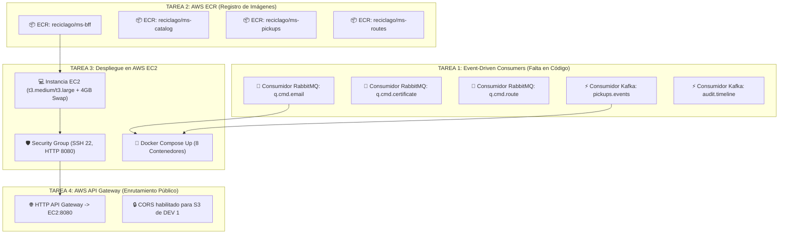

# 🗺️ Hoja de Ruta y Tareas Pendientes: DEV 2 (Backend, EDA & AWS Cloud)
**Proyecto: RecicLaGo — Plataforma Cloud Native de Reciclaje Municipal (Puerto Varas)**  
*Asignatura: Cloud Nativo (Duoc UC)*  
*Responsable: DEV 2 (Ingeniería de Backend, Mensajería Asíncrona e Infraestructura AWS)*

---

## 📌 1. Resumen Ejecutivo del Estado del Proyecto

El desarrollo correspondiente a **DEV 1 (Frontend Angular 18, MSAL Entra ID y ms-bff Gateway en puerto 8080)** se encuentra **100% completado, modularizado y desplegado en AWS S3**. 

Los 4 microservicios backend ya están dockerizados y funcionando localmente en Docker Desktop:
- `ms-reciclago-bff` (Puerto 8080 — Edge Gateway / Resource Server)
- `ms-reciclago-catalog` (Puerto 8081 — Residuos, Camiones y Tarifas)
- `ms-reciclago-pickups` (Puerto 8083 — Ciclo de vida de retiros, Pesaje y Productores EDA)
- `ms-reciclago-routes` (Puerto 8084 — Cuadrantes, Telemetría y Contacto DIMAO)
- Contenedores de soporte: PostgreSQL 15 (`5433:5432`), RabbitMQ 3 (`5672 / 15672`), Kafka (`9092 / 29092`) y Zookeeper (`2181`).

> [!IMPORTANT]
> **ESTE DOCUMENTO CONTIENE EXCLUSIVAMENTE LO QUE LE FALTA POR HACER A DEV 2**. Todo lo relativo a DEV 1 ya fue entregado y no requiere más trabajo.

---

## 📋 2. Matriz de Tareas Pendientes para DEV 2



| # | Área de Trabajo | Descripción del Requerimiento | Estado | Prioridad |
|---|---|---|:---:|:---:|
| **1** | **Consumidores RabbitMQ** | Implementar listeners `@RabbitListener` para `q.cmd.email`, `q.cmd.certificate` y `q.cmd.route`. | ❌ **Pendiente** | 🔴 Crítica |
| **2** | **Consumidor Kafka** | Implementar listener `@KafkaListener` para topic `pickups.events` y `audit.timeline` (Auditoría DIMAO). | ❌ **Pendiente** | 🔴 Crítica |
| **3** | **Amazon ECR** | Crear los 4 repositorios en AWS ECR con la cuenta de DEV 2 y subir las imágenes Docker taggeadas. | ❌ **Pendiente** | 🔴 Crítica |
| **4** | **Amazon EC2** | Levantar instancia EC2 Ubuntu, configurar 4 GB de Swap, Security Group (8080/22) y levantar Docker Compose. | ❌ **Pendiente** | 🔴 Crítica |
| **5** | **AWS API Gateway** | Configurar HTTP API Gateway apuntando al puerto 8080 de EC2 con soporte CORS para el frontend S3. | ❌ **Pendiente** | 🟡 Alta |
| **6** | **Secretos GitHub** | Cargar las credenciales de AWS de DEV 2 en los secretos del repositorio para el despliegue continuo. | ❌ **Pendiente** | 🟢 Media |

---

## 🛠️ 3. Tarea 1: Implementación de Consumidores Asíncronos (Falta en el Código)

### Contexto de Negocio
En `ms-reciclago-pickups`, el servicio `PickupService.java` ya **emite** los eventos hacia RabbitMQ y Kafka cuando un retiro cambia de estado (`PROGRAMADO`, `EN_RUTA`, `RETIRADO`, `PESADO`). **Actualmente no existen consumidores implementados** que procesen estos mensajes en segundo plano.

DEV 2 debe implementar las siguientes clases (se recomienda crearlas en el paquete `com.duoc.ms_reciclago_pickups.consumer` o en un módulo de soporte):

### A. Consumidor de Correos Ciudadanos: `EmailNotificationConsumer.java`
- **Cola a escuchar:** `q.cmd.email`
- **Propósito:** Simular el despacho de correos transaccionales a vecinos cuando su solicitud cambia de estado.

```java
package com.duoc.ms_reciclago_pickups.consumer;

import com.duoc.ms_reciclago_pickups.config.RabbitMQConfig;
import com.duoc.ms_reciclago_pickups.dto.EmailNotificationDto;
import org.slf4j.Logger;
import org.slf4j.LoggerFactory;
import org.springframework.amqp.rabbit.annotation.RabbitListener;
import org.springframework.stereotype.Component;

@Component
public class EmailNotificationConsumer {

    private static final Logger log = LoggerFactory.getLogger(EmailNotificationConsumer.class);

    @RabbitListener(queues = RabbitMQConfig.QUEUE_EMAIL)
    public void receiveEmailCommand(EmailNotificationDto emailDto) {
        log.info("📧 [NOTIFICACIÓN CIUDADANA] Correo despachado con éxito:");
        log.info("   -> Destinatario: {}", emailDto.getTo());
        log.info("   -> Asunto: {}", emailDto.getSubject());
        log.info("   -> Mensaje: {}", emailDto.getBody());
        log.info("   -> ID Retiro asociado: {}", emailDto.getPickupId());
    }
}
```

---

### B. Consumidor de Certificados Ambientales DIMAO: `CertificateGenerationConsumer.java`
- **Cola a escuchar:** `q.cmd.certificate`
- **Propósito:** Generar la certificación digital municipal cuando el chofer finaliza el pesaje en la báscula digital.

```java
package com.duoc.ms_reciclago_pickups.consumer;

import com.duoc.ms_reciclago_pickups.config.RabbitMQConfig;
import com.duoc.ms_reciclago_pickups.dto.CertificateEventDto;
import org.slf4j.Logger;
import org.slf4j.LoggerFactory;
import org.springframework.amqp.rabbit.annotation.RabbitListener;
import org.springframework.stereotype.Component;

@Component
public class CertificateGenerationConsumer {

    private static final Logger log = LoggerFactory.getLogger(CertificateGenerationConsumer.class);

    @RabbitListener(queues = RabbitMQConfig.QUEUE_CERTIFICATE)
    public void generateCertificate(CertificateEventDto certDto) {
        log.info("📜 [CERTIFICADO AMBIENTAL EMITIDO - DIMAO PUERTO VARAS]:");
        log.info("   -> Folio Certificado: DIMAO-CERT-{}", certDto.getPickupId());
        log.info("   -> Vecino Beneficiario: {}", certDto.getVecinoEmail());
        log.info("   -> Kilos Verificados en Báscula: {} kg", certDto.getPesoRealKg());
        log.info("   -> Fecha de Pesaje: {}", certDto.getFechaCompletado());
        log.info("   -> Huella CO2 Evitada estimada: {} kg CO2e", certDto.getPesoRealKg() * 1.85);
    }
}
```

---

### C. Consumidor de Auditoría Inmutable Kafka: `PickupAuditKafkaConsumer.java`
- **Topic a escuchar:** `pickups.events`
- **Consumer Group:** `dimao-audit-group`
- **Propósito:** Almacenar la traza de eventos inmutables de auditoría municipal ante transiciones de estado.

```java
package com.duoc.ms_reciclago_pickups.consumer;

import com.duoc.ms_reciclago_pickups.config.KafkaConfig;
import com.duoc.ms_reciclago_pickups.dto.PickupStateChangeEventDto;
import org.slf4j.Logger;
import org.slf4j.LoggerFactory;
import org.springframework.kafka.annotation.KafkaListener;
import org.springframework.stereotype.Component;

@Component
public class PickupAuditKafkaConsumer {

    private static final Logger log = LoggerFactory.getLogger(PickupAuditKafkaConsumer.class);

    @KafkaListener(topics = KafkaConfig.TOPIC_PICKUPS_EVENTS, groupId = "dimao-audit-group")
    public void consumeStateChangeEvent(PickupStateChangeEventDto event) {
        log.info("⚡ [KAFKA EVENT LOG - AUDITORÍA INMUTABLE]");
        log.info("   -> Evento: {}", event.getEventType());
        log.info("   -> Retiro ID: {}", event.getPickupId());
        log.info("   -> Transición: {} ===> {}", event.getEstadoAnterior(), event.getEstadoNuevo());
        log.info("   -> Camión Cuadrilla: {}", event.getCamionPatente());
        log.info("   -> Kilos Recolectados: {}", event.getPesoRealKg());
        log.info("   -> Timestamp: {}", event.getTimestamp());
    }
}
```

---

## ☁️ 4. Tarea 2: Subir Imágenes a Amazon ECR (Cuenta AWS de DEV 2)

> [!CAUTION]
> **🚨 AVISO CRÍTICO DE CREDENCIALES**:
> DEV 2 **NO DEBE USAR LAS CREDENCIALES DE DEV 1**. Debes copiar tus propias credenciales desde la consola de **AWS Learner Lab / Academy** (botón *AWS Details* ➔ *Show*) y ejecutarlas en tu terminal local.

### Paso 1: Exportar Credenciales Propias de DEV 2 (PowerShell)
```powershell
$env:AWS_ACCESS_KEY_ID="ASIA..."
$env:AWS_SECRET_ACCESS_KEY="..."
$env:AWS_SESSION_TOKEN="..."
$env:AWS_DEFAULT_REGION="us-east-1"

# Validar identidad
aws sts get-caller-identity
```

### Paso 2: Autenticar Docker con Amazon ECR
```powershell
$ACCOUNT_ID = (aws sts get-caller-identity --query Account --output text)
$REGION = "us-east-1"

aws ecr get-login-password --region $REGION | docker login --username AWS --password-stdin "$ACCOUNT_ID.dkr.ecr.$REGION.amazonaws.com"
```

### Paso 3: Crear los 4 Repositorios ECR
```powershell
aws ecr create-repository --repository-name reciclago/ms-bff --region $REGION
aws ecr create-repository --repository-name reciclago/ms-catalog --region $REGION
aws ecr create-repository --repository-name reciclago/ms-pickups --region $REGION
aws ecr create-repository --repository-name reciclago/ms-routes --region $REGION
```

### Paso 4: Construir, Taggear y Subir Imágenes (Push)
```powershell
# 1. ms-bff
docker build -t "$ACCOUNT_ID.dkr.ecr.$REGION.amazonaws.com/reciclago/ms-bff:latest" ./ms-reciclago-bff
docker push "$ACCOUNT_ID.dkr.ecr.$REGION.amazonaws.com/reciclago/ms-bff:latest"

# 2. ms-catalog
docker build -t "$ACCOUNT_ID.dkr.ecr.$REGION.amazonaws.com/reciclago/ms-catalog:latest" ./ms-reciclago-catalog
docker push "$ACCOUNT_ID.dkr.ecr.$REGION.amazonaws.com/reciclago/ms-catalog:latest"

# 3. ms-pickups
docker build -t "$ACCOUNT_ID.dkr.ecr.$REGION.amazonaws.com/reciclago/ms-pickups:latest" ./ms-reciclago-pickups
docker push "$ACCOUNT_ID.dkr.ecr.$REGION.amazonaws.com/reciclago/ms-pickups:latest"

# 4. ms-routes
docker build -t "$ACCOUNT_ID.dkr.ecr.$REGION.amazonaws.com/reciclago/ms-routes:latest" ./ms-reciclago-routes
docker push "$ACCOUNT_ID.dkr.ecr.$REGION.amazonaws.com/reciclago/ms-routes:latest"
```

---

## 💻 5. Tarea 3: Aprovisionamiento y Despliegue en AWS EC2

### Paso 1: Lanzar Instancia EC2
- **AMI:** Ubuntu Server 22.04 LTS o 24.04 LTS (x86_64).
- **Tipo de Instancia:** `t3.medium` (4 GB RAM) o `t3.large` (8 GB RAM).
- **Almacenamiento:** Mínimo 25 GB gp3.
- **Key Pair:** Crear y descargar archivo `.pem` (ej: `reciclago-backend-key.pem`).

### Paso 2: Configurar Security Group de EC2
| Tipo | Puerto | Origen | Propósito |
|---|---|---|---|
| **SSH** | `22` | `Mi IP` | Acceso seguro a consola por terminal |
| **Custom TCP** | `8080` | `0.0.0.0/0` | Tráfico REST entrante al ms-bff (API Gateway / Frontend) |
| **Custom TCP (Opcional)** | `15672` | `Mi IP` | Panel Web de RabbitMQ para monitoreo de colas |

> [!WARNING]
> **NO expongas a internet los puertos internos** (`5432` Postgres, `9092` Kafka, `8081`, `8083`, `8084`). Los contenedores se comunican internamente a través de la red `reciclago-network` de Docker Compose.

---

### Paso 3: Conectar por SSH y Crear Memoria Swap (4 GB)
Debido a que se ejecutan 8 contenedores (Zookeeper, Kafka, RabbitMQ, PostgreSQL y 4 microservicios Spring Boot), **activar Swap es obligatorio para evitar caídas por OOM (Out Of Memory)**:

```bash
# Conectar por SSH
ssh -i "reciclago-backend-key.pem" ubuntu@<IP_PUBLICA_EC2>

# Configurar 4 GB de Swap
sudo fallocate -l 4G /swapfile
sudo chmod 600 /swapfile
sudo mkswap /swapfile
sudo swapon /swapfile
echo '/swapfile none swap sw 0 0' | sudo tee -a /etc/fstab

# Validar memoria disponible
free -h
```

---

### Paso 4: Instalar Docker y Docker Compose en EC2
```bash
sudo apt update && sudo apt install -y docker.io docker-compose-v2
sudo usermod -aG docker $USER
newgrp docker
```

---

### Paso 5: Login a ECR y Despliegue de los 8 Contenedores
```bash
# Autenticar EC2 contra ECR
aws ecr get-login-password --region us-east-1 | docker login --username AWS --password-stdin "<ACCOUNT_ID>.dkr.ecr.us-east-1.amazonaws.com"

# Clonar el proyecto
git clone https://github.com/kr0zapps/reciclago-cloud-nativo.git
cd reciclago-cloud-nativo

# Levantar toda la infraestructura en segundo plano
ECR_REGISTRY="<ACCOUNT_ID>.dkr.ecr.us-east-1.amazonaws.com/reciclago" docker compose up -d

# Verificar que los 8 contenedores estén Up y Healthy
docker ps --format "table {{.Names}}\t{{.Status}}\t{{.Ports}}"
```

---

## 🛡️ 6. Tarea 4: Configuración de AWS API Gateway y CORS

Para conectar el Frontend que está en AWS S3 con la IP pública de EC2:

1. **Crear HTTP API en AWS API Gateway:**
   - Nombre: `reciclago-http-api`.
   - Integración: `HTTP` $\rightarrow$ URL: `http://<IP_PUBLICA_EC2>:8080`.
2. **Rutas (Routes):**
   - Ruta ANY: `/api/{proxy+}` dirigida a la integración HTTP.
3. **CORS:**
   - **Access-Control-Allow-Origin:**  
     `http://reciclago-frontend-puertovaras.s3-website-us-east-1.amazonaws.com` y `http://localhost:4200`
   - **Access-Control-Allow-Headers:** `Authorization, Content-Type, Accept`
   - **Access-Control-Allow-Methods:** `GET, POST, PUT, PATCH, DELETE, OPTIONS`

---

## 🧪 7. Guía de Pruebas de Integración para la Defensa Docente

DEV 2 debe poder demostrar en vivo el ciclo de vida completo de un retiro en la terminal o mediante Swagger/cURL:

### 1. Vecino crea solicitud (`SOLICITADO`):
```bash
curl -X POST "http://<IP_PUBLICA_EC2>:8080/api/pickups" \
  -H "Content-Type: application/json" \
  -d '{
    "direccion": "Los Guindos 450, Puerto Varas",
    "residuoId": 1,
    "pesoEstimadoKg": 8.5,
    "comentarios": "4 cajas de botellas de vidrio limpias"
  }'
```

### 2. Coordinador programa la fecha y camión (`PROGRAMADO`):
```bash
curl -X POST "http://<IP_PUBLICA_EC2>:8080/api/pickups/1/programar" \
  -H "Content-Type: application/json" \
  -d '{
    "camionId": 1,
    "camionPatente": "PV-RC-2026",
    "fechaProgramada": "2026-09-17T10:30:00"
  }'
```
*-> Verificar en los logs de EC2 que `q.cmd.email` recibió el correo para el vecino.*

### 3. Chofer inicia recorrido en terreno (`EN_RUTA`):
```bash
curl -X PATCH "http://<IP_PUBLICA_EC2>:8080/api/pickups/1/en-ruta"
```
*-> Verificar en los logs que Kafka `pickups.events` registró el cambio de estado a EN_RUTA.*

### 4. Chofer confirma recolección en puerta (`RETIRADO`):
```bash
curl -X PATCH "http://<IP_PUBLICA_EC2>:8080/api/pickups/1/retirado"
```

### 5. Chofer registra pesaje certificado en báscula (`PESADO`):
```bash
curl -X POST "http://<IP_PUBLICA_EC2>:8080/api/pickups/1/pesaje" \
  -H "Content-Type: application/json" \
  -d '{"pesoRealKg": 8.4}'
```
*-> Verificar en logs que `q.cmd.certificate` emitió el certificado oficial DIMAO.*

---

## 👥 8. Cuentas de Prueba Oficiales (Microsoft Entra ID)

| Rol | Correo Institucional | Credencial de Prueba | Funcionalidad en Evaluación |
|:---|:---|:---|:---|
| **Vecino** | `jon.vidals@duocuc.cl` | Contraseña asignada | Solicita retiro, ingresa peso estimado, ve trazabilidad. |
| **Coordinador** | `coordinador@reciclago.onmicrosoft.com` | Contraseña asignada | Programa fecha y asigna camión oficial a la orden. |
| **Chofer** | `chofer@reciclago.onmicrosoft.com` | Contraseña asignada | Inicia ruta GPS, confirma retiro y registra báscula digital. |
| **Admin** | `admin@reciclago.onmicrosoft.com` | Contraseña asignada | Auditoría DIMAO, balance de huella de carbono y control de flota. |
