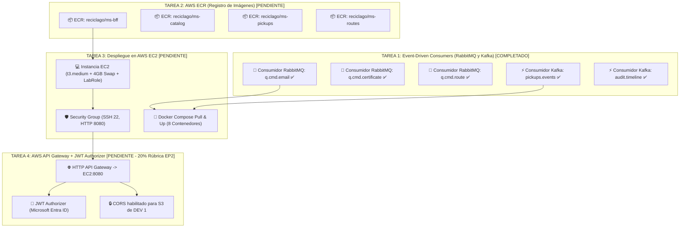

# 🗺️ Hoja de Ruta y Guía de Implementación: DEV 2 (Backend, EDA & AWS Cloud)
**Proyecto: RecicLaGo — Plataforma Cloud Native de Reciclaje Municipal (Puerto Varas)**  
*Asignatura: Cloud Nativo (Duoc UC)*  
*Responsable: DEV 2 (Ingeniería de Backend, Mensajería Asíncrona e Infraestructura AWS)*

---

## 📌 1. Resumen Ejecutivo del Estado del Proyecto

El desarrollo correspondiente a **DEV 1 (Frontend Angular 19, MSAL Entra ID y ms-bff Gateway en puerto 8080)** se encuentra **100% completado, modularizado y desplegado en AWS S3**. 

Respecto a **DEV 2 (Backend, EDA & AWS Cloud)**:
- ✅ **CÓDIGO DE CONSUMIDORES EDA 100% COMPLETADO Y COMPILADO:** Los listeners de RabbitMQ (`q.cmd.email`, `q.cmd.certificate`, `q.cmd.route`) y Kafka (`pickups.events`, `audit.timeline`) ya fueron implementados en `ms-reciclago-pickups/src/main/java/com/duoc/ms_reciclago_pickups/consumer/` y validados con Maven.
- ⏳ **PENDIENTE DEV 2:** Despliegue de infraestructura en la nube de AWS (ECR, EC2, API Gateway + JWT Authorizer).

Los 4 microservicios backend están dockerizados y compilados:
- `ms-reciclago-bff` (Puerto 8080 — Edge Gateway / Resource Server OAuth2)
- `ms-reciclago-catalog` (Puerto 8081 — Residuos, Camiones y Tarifas)
- `ms-reciclago-pickups` (Puerto 8083 — Ciclo de vida de retiros, Pesaje, Productores & Consumidores EDA)
- `ms-reciclago-routes` (Puerto 8084 — Cuadrantes, Telemetría y Contacto DIMAO)
- Contenedores de soporte: PostgreSQL 15 (`5433:5432`), RabbitMQ 3 (`5672 / 15672`), Kafka (`9092 / 29092`) y Zookeeper (`2181`).

> [!IMPORTANT]
> **ESTE DOCUMENTO SE MANTIENE ACTUALIZADO CON LO QUE LE FALTA POR HACER A DEV 2**.
> Consulta también la guía complementaria: [DEV2_TAREAS_MICROSERVICIOS.md](file:///c:/Users/krosa/Desktop/Universidad/semestre%206/cloud%20nativo/reciclago/DEV2_TAREAS_MICROSERVICIOS.md) para la implementación del catálogo rotativo semanal y la gestión real de flota de camiones en los microservicios.

---

## 📋 2. Matriz de Tareas para DEV 2



| # | Área de Trabajo | Descripción del Requerimiento | Estado | Prioridad |
|---|---|---|:---:|:---:|
| **1** | **Consumidores RabbitMQ** | Listener `@RabbitListener` para `q.cmd.email`, `q.cmd.certificate` y `q.cmd.route`. | ✅ **Completado (100% Código Java)** | 🟢 Resuelto |
| **2** | **Consumidores Kafka** | Listener `@KafkaListener` para topics `pickups.events` y `audit.timeline` (Auditoría DIMAO). | ✅ **Completado (100% Código Java)** | 🟢 Resuelto |
| **3** | **Amazon ECR** | Crear los 4 repositorios en AWS ECR con la cuenta de DEV 2 y subir las imágenes Docker taggeadas. | ❌ **Pendiente (Nube AWS)** | 🔴 Crítica |
| **4** | **Amazon EC2** | Levantar instancia EC2 Ubuntu, asociar rol `LabRole`, configurar 4 GB Swap, SG (8080/22) y Docker Compose. | ❌ **Pendiente (Nube AWS)** | 🔴 Crítica |
| **5** | **AWS API Gateway + JWT Authorizer** | Configurar HTTP API Gateway con JWT Authorizer de Microsoft Entra ID (20% nota EP2) y CORS. | ❌ **Pendiente (Nube AWS)** | 🔴 Crítica |
| **6** | **Secretos GitHub** | Cargar las credenciales de AWS de DEV 2 en los secretos del repositorio para CI/CD continuo. | ❌ **Pendiente (GitHub Repositorio)** | 🟢 Media |

---

## 🛠️ 3. Tarea 1: Consumidores Asíncronos (COMPLETADO EN CÓDIGO)

> [!NOTE]
> **ESTADO: 100% IMPLEMENTADO Y VERIFICADO EN CÓDIGO JAVA**.
> Los 4 consumidores (`EmailNotificationConsumer`, `CertificateGenerationConsumer`, `RouteDispatchConsumer` y `PickupAuditKafkaConsumer`) fueron creados en `ms-reciclago-pickups/src/main/java/com/duoc/ms_reciclago_pickups/consumer/` y compilaron exitosamente en Maven. A continuación se mantiene la referencia de código:

### Contexto de Negocio
En `ms-reciclago-pickups`, el servicio `PickupService.java` ya **emite** los eventos hacia RabbitMQ y Kafka cuando un retiro cambia de estado (`PROGRAMADO`, `EN_RUTA`, `RETIRADO`, `PESADO`).

Crea los siguientes archivos en el paquete:
`ms-reciclago-pickups/src/main/java/com/duoc/ms_reciclago_pickups/consumer/`

---

### A. Consumidor de Correos Ciudadanos: `EmailNotificationConsumer.java`
- **Cola:** `q.cmd.email` (`RabbitMQConfig.QUEUE_EMAIL`)
- **DTO:** `EmailEventDto`
- **Propósito:** Notificar al vecino ante cada hito de su solicitud.

```java
package com.duoc.ms_reciclago_pickups.consumer;

import com.duoc.ms_reciclago_pickups.config.RabbitMQConfig;
import com.duoc.ms_reciclago_pickups.dto.EmailEventDto;
import org.slf4j.Logger;
import org.slf4j.LoggerFactory;
import org.springframework.amqp.rabbit.annotation.RabbitListener;
import org.springframework.stereotype.Component;

@Component
public class EmailNotificationConsumer {

    private static final Logger log = LoggerFactory.getLogger(EmailNotificationConsumer.class);

    @RabbitListener(queues = RabbitMQConfig.QUEUE_EMAIL)
    public void receiveEmailCommand(EmailEventDto emailDto) {
        log.info("📧 [NOTIFICACIÓN CIUDADANA DIMAO] Enviando correo electrónico:");
        log.info("   -> Código Retiro: {}", emailDto.getCodigoRetiro());
        log.info("   -> Destinatario: {}", emailDto.getDestinatarioEmail());
        log.info("   -> Asunto: {}", emailDto.getAsunto());
        log.info("   -> Nuevo Estado: {}", emailDto.getNuevoEstado());
        log.info("   -> Mensaje: {}", emailDto.getMensaje());
    }
}
```

---

### B. Consumidor de Certificados Ambientales: `CertificateGenerationConsumer.java`
- **Cola:** `q.cmd.certificate` (`RabbitMQConfig.QUEUE_CERTIFICATE`)
- **DTO:** `CertificateEventDto`
- **Propósito:** Generar certificado ambiental municipal y cálculo de CO2 evitado tras el pesaje.

```java
package com.duoc.ms_reciclago_pickups.consumer;

import com.duoc.ms_reciclago_pickups.config.RabbitMQConfig;
import com.duoc.ms_reciclago_pickups.dto.CertificateEventDto;
import org.slf4j.Logger;
import org.slf4j.LoggerFactory;
import org.springframework.amqp.rabbit.annotation.RabbitListener;
import org.springframework.stereotype.Component;

@Component
public class CertificateGenerationConsumer {

    private static final Logger log = LoggerFactory.getLogger(CertificateGenerationConsumer.class);

    @RabbitListener(queues = RabbitMQConfig.QUEUE_CERTIFICATE)
    public void generateCertificate(CertificateEventDto certDto) {
        double co2Evitado = certDto.getPesoRealKg() != null ? certDto.getPesoRealKg() * 1.85 : 0.0;
        log.info("📜 [CERTIFICADO AMBIENTAL EMITIDO - DIMAO PUERTO VARAS]:");
        log.info("   -> Folio Certificado: DIMAO-CERT-{}", certDto.getCodigoRetiro());
        log.info("   -> Vecino Beneficiario: {}", certDto.getVecinoEmail());
        log.info("   -> Kilos Verificados en Báscula: {} kg", certDto.getPesoRealKg());
        log.info("   -> Fecha de Pesaje: {}", certDto.getFechaCompletado());
        log.info("   -> Huella CO2 Evitada estimada: {} kg CO2e", String.format("%.2f", co2Evitado));
    }
}
```

---

### C. Consumidor de Hoja de Ruta Logística: `RouteDispatchConsumer.java`
- **Cola:** `q.cmd.route` (`RabbitMQConfig.QUEUE_ROUTE`)
- **DTO:** `RouteEventDto`
- **Propósito:** Notificar a la central de despacho municipal y chofer sobre paradas asignadas.

```java
package com.duoc.ms_reciclago_pickups.consumer;

import com.duoc.ms_reciclago_pickups.config.RabbitMQConfig;
import com.duoc.ms_reciclago_pickups.dto.RouteEventDto;
import org.slf4j.Logger;
import org.slf4j.LoggerFactory;
import org.springframework.amqp.rabbit.annotation.RabbitListener;
import org.springframework.stereotype.Component;

@Component
public class RouteDispatchConsumer {

    private static final Logger log = LoggerFactory.getLogger(RouteDispatchConsumer.class);

    @RabbitListener(queues = RabbitMQConfig.QUEUE_ROUTE)
    public void receiveRouteCommand(RouteEventDto routeDto) {
        log.info("🚛 [HOJA DE RUTA DIMAO - DESPACHO MUNICIPAL]:");
        log.info("   -> Código Retiro: {}", routeDto.getCodigoRetiro());
        log.info("   -> Camión Asignado: {}", routeDto.getCamionPatente());
        log.info("   -> Sector / Cuadrante: {}", routeDto.getSector());
        log.info("   -> Fecha Programada: {}", routeDto.getFechaProgramada());
    }
}
```

---

### D. Consumidor de Auditoría Inmutable Kafka: `PickupAuditKafkaConsumer.java`
- **Topics:** `pickups.events` y `audit.timeline`
- **DTO:** `PickupStateChangeEventDto`
- **Consumer Group:** `dimao-audit-group`
- **Propósito:** Registro inmutable en Kafka para auditoría municipal y analítica.

```java
package com.duoc.ms_reciclago_pickups.consumer;

import com.duoc.ms_reciclago_pickups.config.KafkaConfig;
import com.duoc.ms_reciclago_pickups.dto.PickupStateChangeEventDto;
import org.slf4j.Logger;
import org.slf4j.LoggerFactory;
import org.springframework.kafka.annotation.KafkaListener;
import org.springframework.stereotype.Component;

@Component
public class PickupAuditKafkaConsumer {

    private static final Logger log = LoggerFactory.getLogger(PickupAuditKafkaConsumer.class);

    @KafkaListener(topics = {KafkaConfig.TOPIC_PICKUPS_EVENTS, KafkaConfig.TOPIC_AUDIT_TIMELINE}, groupId = "dimao-audit-group")
    public void consumeStateChangeEvent(PickupStateChangeEventDto event) {
        log.info("⚡ [KAFKA EVENT LOG - AUDITORÍA INMUTABLE DIMAO]:");
        log.info("   -> ID: {} | Código: {}", event.getPickupId(), event.getCodigoRetiro());
        log.info("   -> Transición: {} ===> {}", event.getEstadoAnterior(), event.getEstadoNuevo());
        log.info("   -> Vecino: {} | Comuna: {}", event.getVecinoEmail(), event.getComuna());
        log.info("   -> Residuo: {} | Peso Est.: {} kg | Peso Real: {} kg",
                event.getResiduoNombre(), event.getPesoEstimadoKg(), event.getPesoRealKg());
        log.info("   -> Timestamp: {}", event.getTimestamp());
    }
}
```

> [!NOTE]
> Las propiedades de deserialización de Kafka para `dimao-audit-group` ya fueron agregadas en `ms-reciclago-pickups/src/main/resources/application.properties`.

---

## ☁️ 4. Tarea 2: Subir Imágenes a Amazon ECR (Cuenta AWS de DEV 2)

> [!CAUTION]
> **🚨 AVISO DE CREDENCIALES**:
> DEV 2 **NO DEBE USAR LAS CREDENCIALES DE DEV 1**. Debes copiar tus propias credenciales desde la consola de **AWS Learner Lab / Academy** (botón *AWS Details* ➔ *Show*).

### Paso 1: Configurar Credenciales en Terminal Local
```powershell
$env:AWS_ACCESS_KEY_ID="ASIA..."
$env:AWS_SECRET_ACCESS_KEY="..."
$env:AWS_SESSION_TOKEN="..."
$env:AWS_DEFAULT_REGION="us-east-1"

# Validar identidad
aws sts get-caller-identity
```

### Paso 2: Autenticar Docker con Amazon ECR
```powershell
$ACCOUNT_ID = (aws sts get-caller-identity --query Account --output text)
$REGION = "us-east-1"

aws ecr get-login-password --region $REGION | docker login --username AWS --password-stdin "$ACCOUNT_ID.dkr.ecr.$REGION.amazonaws.com"
```

### Paso 3: Crear los 4 Repositorios ECR
```powershell
aws ecr create-repository --repository-name reciclago/ms-bff --region $REGION
aws ecr create-repository --repository-name reciclago/ms-catalog --region $REGION
aws ecr create-repository --repository-name reciclago/ms-pickups --region $REGION
aws ecr create-repository --repository-name reciclago/ms-routes --region $REGION
```

### Paso 4: Construir, Taggear y Subir Imágenes
```powershell
# 1. ms-bff
docker build -t "$ACCOUNT_ID.dkr.ecr.$REGION.amazonaws.com/reciclago/ms-bff:latest" ./ms-reciclago-bff
docker push "$ACCOUNT_ID.dkr.ecr.$REGION.amazonaws.com/reciclago/ms-bff:latest"

# 2. ms-catalog
docker build -t "$ACCOUNT_ID.dkr.ecr.$REGION.amazonaws.com/reciclago/ms-catalog:latest" ./ms-reciclago-catalog
docker push "$ACCOUNT_ID.dkr.ecr.$REGION.amazonaws.com/reciclago/ms-catalog:latest"

# 3. ms-pickups
docker build -t "$ACCOUNT_ID.dkr.ecr.$REGION.amazonaws.com/reciclago/ms-pickups:latest" ./ms-reciclago-pickups
docker push "$ACCOUNT_ID.dkr.ecr.$REGION.amazonaws.com/reciclago/ms-pickups:latest"

# 4. ms-routes
docker build -t "$ACCOUNT_ID.dkr.ecr.$REGION.amazonaws.com/reciclago/ms-routes:latest" ./ms-reciclago-routes
docker push "$ACCOUNT_ID.dkr.ecr.$REGION.amazonaws.com/reciclago/ms-routes:latest"
```

---

## 💻 5. Tarea 3: Aprovisionamiento y Despliegue en AWS EC2

### Paso 1: Lanzar Instancia EC2
- **AMI:** Ubuntu Server 22.04 LTS o 24.04 LTS (x86_64).
- **Tipo:** `t3.medium` (4 GB RAM).
- **Almacenamiento:** Mínimo 25 GB gp3.
- **IAM Role:** Asignar el rol `LabRole` a la instancia (Consola EC2 ➔ Seleccionar instancia ➔ *Actions* ➔ *Security* ➔ *Modify IAM role* ➔ Elegir `LabRole`). Esto permite hacer login a ECR sin ingresar credenciales temporales.
- **Key Pair:** Descargar llave `.pem`.

### Paso 2: Security Group de EC2
| Tipo | Puerto | Origen | Propósito |
|---|---|---|---|
| **SSH** | `22` | `Mi IP` | Conexión terminal |
| **Custom TCP** | `8080` | `0.0.0.0/0` | ms-bff (expuesto hacia API Gateway / Frontend) |
| **Custom TCP (Opcional)** | `15672` | `Mi IP` | Panel Web RabbitMQ |

### Paso 3: Conectar por SSH y Configurar 4 GB de Swap
```bash
ssh -i "tu-llave.pem" ubuntu@<IP_PUBLICA_EC2>

# Configurar 4 GB de Swap
sudo fallocate -l 4G /swapfile
sudo chmod 600 /swapfile
sudo mkswap /swapfile
sudo swapon /swapfile
echo '/swapfile none swap sw 0 0' | sudo tee -a /etc/fstab
free -h
```

### Paso 4: Instalar Docker, Docker Compose y AWS CLI
```bash
sudo apt update
sudo apt install -y docker.io docker-compose-plugin awscli
sudo usermod -aG docker $USER
newgrp docker
```

### Paso 5: Login a ECR y Despliegue de Contenedores
```bash
# Login a ECR usando el rol LabRole (automático sin credenciales manuales)
aws ecr get-login-password --region us-east-1 | docker login --username AWS --password-stdin "<ACCOUNT_ID>.dkr.ecr.us-east-1.amazonaws.com"

# Clonar el proyecto
git clone https://github.com/kr0zapps/reciclago-cloud-nativo.git
cd reciclago-cloud-nativo

# Descargar las imágenes desde ECR (evita compilar en la máquina para no saturar memoria)
export ECR_REGISTRY="<ACCOUNT_ID>.dkr.ecr.us-east-1.amazonaws.com/reciclago"
docker compose pull ms-bff ms-catalog ms-pickups ms-routes

# Levantar los 8 contenedores
docker compose up -d --no-build

# Verificar estado
docker ps --format "table {{.Names}}\t{{.Status}}\t{{.Ports}}"
```

---

## 🛡️ 6. Tarea 4: AWS API Gateway + JWT Authorizer (20% Ponderación Rúbrica EP2)

> [!IMPORTANT]
> **REQUISITO EVALUADO DIRECTAMENTE POR LA RÚBRICA DE EVALUACIÓN**:
> La pauta docente exige que el API Gateway valide tokens JWT de Azure AD, rechazando peticiones no autorizadas y aceptando las válidas.

### Paso 1: Crear HTTP API
1. En la consola de **AWS API Gateway**, crear una **HTTP API**.
2. Nombre: `reciclago-api-gateway`.
3. Integración inicial: Tipo `HTTP`, URL: `http://<IP_PUBLICA_EC2>:8080`.

### Paso 2: Crear el JWT Authorizer
1. En el menú lateral de la API, ir a **Authorization** ➔ pestaña **Manage authorizers** ➔ **Create authorizer**.
2. **Authorizer type:** `JWT`
3. **Name:** `EntraIdAuthorizer`
4. **Identity source:** `$request.header.Authorization`
5. **Issuer:** `https://login.microsoftonline.com/5625266d-cae0-4070-a7ea-b5e88273580f/v2.0`
6. **Audience:** `api://9a946a0b-5350-4fe1-a79e-ca332612f60d`
7. Clic en **Create**.

### Paso 3: Configurar Rutas y Asociar el Authorizer
1. Crear la ruta `ANY /api/{proxy+}` vinculada a la integración HTTP `http://<IP_PUBLICA_EC2>:8080`.
2. Asociar el `EntraIdAuthorizer` a la ruta `ANY /api/{proxy+}`.
3. Crear excepciones públicas (sin Authorizer) para endpoints de consulta comunitaria:
   - `GET /public/{proxy+}` ➔ Sin Authorizer
   - `OPTIONS /{proxy+}` ➔ Sin Authorizer (requerido para preflight CORS)

### Paso 4: Habilitar CORS en API Gateway
1. Ir a **CORS** en el menú de la API.
2. **Access-Control-Allow-Origin:**  
   `http://reciclago-frontend-puertovaras.s3-website-us-east-1.amazonaws.com`  
   `https://reciclago-frontend-puertovaras.s3.us-east-1.amazonaws.com`  
   `http://localhost:4200`
3. **Access-Control-Allow-Headers:** `Authorization, Content-Type, Accept`
4. **Access-Control-Allow-Methods:** `GET, POST, PUT, PATCH, DELETE, OPTIONS`
5. **Access-Control-Allow-Credentials:** `true`

---

## 🧪 7. Guía de Pruebas de Integración para la Defensa Docente

### Opción A: Pruebas Rápidas Locales en EC2 (Directo a ms-pickups sin Token JWT)
Permite verificar en segundos que RabbitMQ y Kafka procesan eventos sin requerir token OAuth2:

```bash
# 1. Crear solicitud (SOLICITADO)
curl -X POST "http://localhost:8083/api/pickups" \
  -H "Content-Type: application/json" \
  -d '{
    "direccion": "Costanera Sur 567, Puerto Varas",
    "comuna": "Puerto Varas",
    "residuoId": 2,
    "residuoNombre": "Vidrio",
    "pesoEstimadoKg": 12.0,
    "vecinoEmail": "jon.vidals@duocuc.cl",
    "vecinoNombre": "Jonatan Vidal",
    "comentarios": "Botellas de vidrio clasificadas"
  }'

# 2. Programar retiro (SOLICITADO -> PROGRAMADO)
curl -X PATCH "http://localhost:8083/api/pickups/1/programar?camionId=1&camionPatente=PV-RC-2026&fechaProgramada=2026-09-22T10:30:00"

# 3. Chofer inicia ruta (PROGRAMADO -> EN_RUTA)
curl -X PATCH "http://localhost:8083/api/pickups/1/en-ruta"

# 4. Chofer recolecta en domicilio (EN_RUTA -> RETIRADO)
curl -X PATCH "http://localhost:8083/api/pickups/1/retirado"

# 5. Báscula digital registra pesaje (RETIRADO -> PESADO)
curl -X PATCH "http://localhost:8083/api/pickups/1/pesado?pesoRealKg=11.8"

# 6. Ver logs de RabbitMQ y Kafka en vivo:
docker logs -f reciclago-ms-pickups
```

### Opción B: Pruebas Completas a través del BFF (Puerto 8080 con Bearer Token)
```bash
TOKEN="<TU_TOKEN_JWT_DE_AZURE_AD>"

# Crear retiro
curl -X POST "http://<IP_EC2>:8080/api/pickups" \
  -H "Authorization: Bearer $TOKEN" \
  -H "Content-Type: application/json" \
  -d '{"direccion": "Costanera Sur 567", "residuoId": 2, "pesoEstimadoKg": 12.0}'

# Programar
curl -X PATCH "http://<IP_EC2>:8080/api/pickups/1/programar?camionId=1&camionPatente=PV-RC-2026&fechaProgramada=2026-09-22T10:30:00" \
  -H "Authorization: Bearer $TOKEN"

# En ruta
curl -X PATCH "http://<IP_EC2>:8080/api/pickups/1/en-ruta" \
  -H "Authorization: Bearer $TOKEN"

# Retirado
curl -X PATCH "http://<IP_EC2>:8080/api/pickups/1/retirado" \
  -H "Authorization: Bearer $TOKEN"

# Pesado
curl -X PATCH "http://<IP_EC2>:8080/api/pickups/1/pesado?pesoRealKg=11.8" \
  -H "Authorization: Bearer $TOKEN"
```

---

## 👥 8. Cuentas de Prueba Oficiales (Microsoft Entra ID)

| Rol | Correo Institucional | Funcionalidad en la Evaluación Docente |
|:---|:---|:---|
| **Vecino** | `jon.vidals@duocuc.cl` | Solicita retiro, ingresa peso estimado (kg), visualiza seguimiento 3 pasos. |
| **Coordinador** | `coordinador@reciclago.onmicrosoft.com` | Calendario restrictivo por cuadrante, asigna camión oficial y fecha municipal. |
| **Chofer** | `chofer@reciclago.onmicrosoft.com` | Filtra por patente (`PV-RC-2026`), inicia recorrido, confirma retiro y pesaje báscula. |
| **Admin** | `admin@reciclago.onmicrosoft.com` | Métricas comunales de huella CO2, auditoría DIMAO y monitoreo de flota. |
