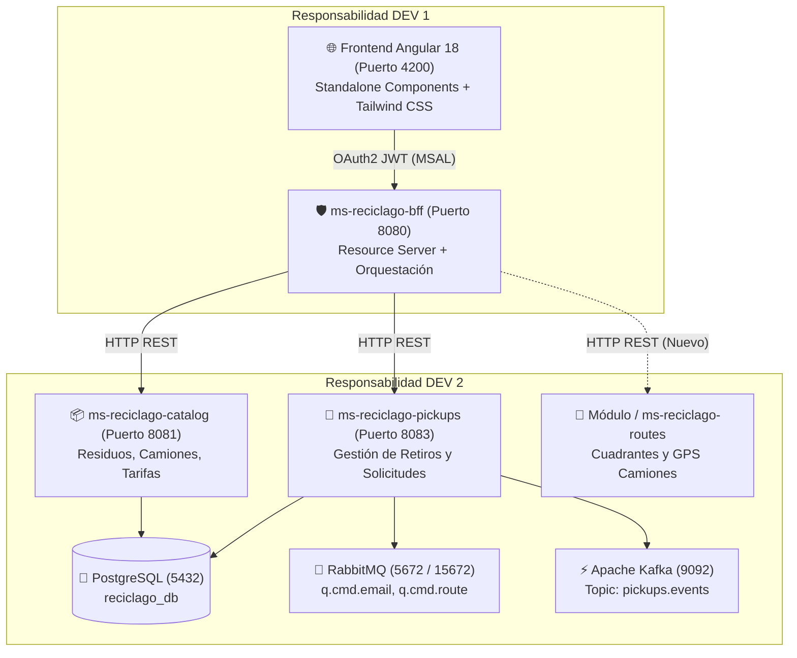
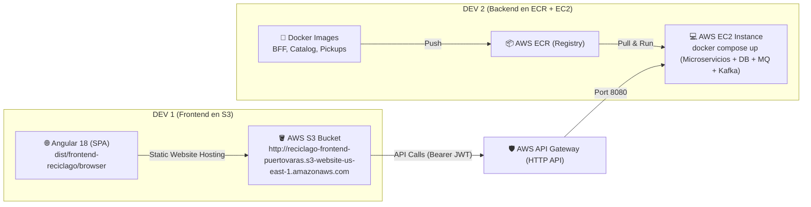
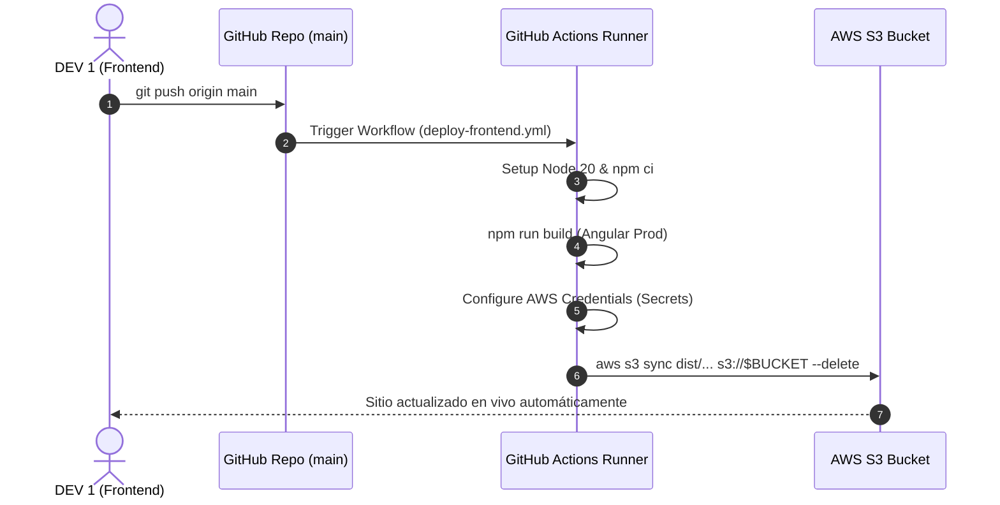

# 🗺️ Ruta de Trabajo y Plan de Implementación: RecicLaGo
**Sistema Municipal de Reciclaje Puerta a Puerta — Comuna de Puerto Varas**  
*Asignatura: Cloud Nativo (Duoc UC)*

---

## 📌 1. Visión y Objetivos del Proyecto

El proyecto **RecicLaGo** es una plataforma Cloud Native orientada al reciclaje municipal sustentable en Puerto Varas, diseñada bajo una arquitectura de microservicios con **Event-Driven Architecture (EDA)** y Frontend desacoplado con **BFF (Backend For Frontend)**.



---

## 👥 2. Matriz de Roles y Asignación de Responsabilidades

| Rol | Componentes a Cargo | Tecnologías Clave | Responsabilidad Primaria |
| :--- | :--- | :--- | :--- |
| **DEV 1** | • `frontend-reciclago`<br>• `ms-reciclago-bff` | Angular 18, Tailwind CSS, MSAL Entra ID, Spring Boot 3, Spring Security OAuth2, RestClient. | • Experiencia de Usuario (UI/UX), diseño responsivo móvil/desktop.<br>• Interactividad del 100% de botones y enlaces (cero `#`).<br>• Centralización de seguridad y consumo unificado en el BFF. |
| **DEV 2** | • `ms-reciclago-catalog`<br>• `ms-reciclago-pickups`<br>• `docker-compose.yml` | Java 17, Spring Boot 3, Spring Data JPA, PostgreSQL, RabbitMQ, Apache Kafka. | • Lógica de negocio core, persistencia relacional y migraciones.<br>• Ciclo de vida del retiro y emisión de eventos Kafka.<br>• Gestión de infraestructura en contenedores Docker y compatibilidad Java 17. |

---

## 🔍 3. Auditoría de Interactividad Frontend (Todos los `<a>` y `<button>`)

Para cumplir la regla estricta: **"cada botón o enlace debe ser clickeable y funcional"**, a continuación se define el estado y la acción para cada elemento del sistema:

| Componente | Elemento UI | Destino Actual | Estado Backend / Mock | Acción Frontend | Endpoint Backend Requerido (DEV 2) |
| :--- | :--- | :--- | :--- | :--- | :--- |
| **Header** | Logo RecicLaGo | `/` | ✅ Soportado | Navega a inicio sin recargar. | `N/A` |
| **Header** | Enlace "Inicio" | `/` | ✅ Soportado | RouterLink activo con indicador visual. | `N/A` |
| **Header** | "¿Cómo funciona?" | Modal Cívico | ✅ Completado | Abre Modal Guía Ciudadana en 4 pasos + tip condominios. | `GET /api/citizens/how-it-works` (Opcional) |
| **Header** | "Materiales" | Modal Cívico | ✅ Completado | Abre Modal con las 4 Fracciones Oficiales DIMAO. | `GET /api/catalog/residuos` |
| **Header** | "Retiro especial" | `/dashboard` | ✅ Soportado | Redirige al Dashboard y enfoca el formulario. | `POST /api/pickups` |
| **Header** | "Contacto DIMAO" | Modal Cívico | ✅ Completado | Abre Modal Mesa de Ayuda DIMAO (Teléfono, correo, oficina). | `POST /api/citizens/contact` |
| **Header** | "Mi cuenta" | `/login` | ✅ Soportado | Redirige al login comunal con soporte `returnUrl`. | `N/A (MSAL)` |
| **Header** | Salir | `logout()` | ✅ Soportado | Limpia tokens y redirige a la portada. | `N/A (MSAL)` |
| **Footer** | "Materiales" | Modal Cívico | ✅ Completado | Abre Guía Oficial de Clasificación de Residuos. | `GET /api/catalog/residuos` |
| **Footer** | "Contacto" | Modal Cívico | ✅ Completado | Abre Modal de Contacto y Emergencias DIMAO. | `POST /api/citizens/contact` |
| **Footer** | RRSS (FB, IG, YT) | Enlaces Externos | ✅ Soportado | Enlaces oficiales a Municipalidad de Puerto Varas (`target="_blank"`). | `N/A` |
| **Home** | Buscador Dirección | Formulario | ❌ Pendiente DEV 2 | Valida dirección y transfiere parámetro a dashboard. | `GET /api/routes/cuadrante?direccion={}` |
| **Home** | "Ver mi día de retiro" | `/dashboard` | ✅ Soportado | Redirige al panel vecinal. | `GET /api/routes/cuadrante` |
| **Home** | "Seguir mi camión" | `/dashboard` | ❌ Pendiente DEV 2 | Redirige al mapa barrial interactivo. | `GET /api/routes/{id}/tracking` |
| **Home** | "Qué reciclar" | Modal Cívico | ✅ Completado | Abre Guía Oficial de Fracciones de Reciclaje. | `GET /api/catalog/residuos` |
| **Home** | "Preguntas frecuentes" | Modal Cívico | ✅ Completado | Abre Modal de FAQ oficial con respuestas comunitarias. | `GET /api/citizens/faq` |
| **Dashboard** | "Agendar retiro especial" | `#solicitud-retiro` | ✅ Soportado | Scroll animado suave directo al formulario. | `POST /api/pickups` |
| **Dashboard** | "Ver recorrido completo" | Modal Cívico | ✅ Completado | Abre Modal con Cuadrantes 1 al 4 y "Tu Sector". | `GET /api/routes/cuadrante` |
| **Dashboard** | "Ver todos los retiros" | Modal Cívico | ✅ Completado | Abre Modal de Historial Trazable con kilos acumulados. | `GET /api/pickups/history` |
| **Dashboard** | "Agendar retiro municipal" | `type="submit"` | ✅ Soportado | Envío directo de solicitud vía BFF. | `POST /api/pickups` |

---

## 🛠️ 4. Plan de Trabajo Detallado: DEV 1 (Frontend + BFF)

### Fase 1: Frontend Angular 18 (`frontend-reciclago`) — [COMPLETADO ✅]
1. **Autenticación Interna & Auth Guard Personalizado:**
   * Sustituido `MsalGuard` genérico por `authGuard` funcional: al intentar acceder a rutas protegidas (`/dashboard`), el usuario no autenticado es redirigido a `/login?returnUrl=...` (pantalla comunal de RecicLaGo) en lugar de ser enviado bruscamente a Microsoft Online.
   * `LoginComponent` y `AppComponent` capturan el `returnUrl` (mediante `ActivatedRoute` y `sessionStorage`) y tras autenticarse con Microsoft Entra ID redirigen fluidamente al `/dashboard`.
2. **Menú Móvil Responsivo (Hamburger Menu):**
   * Botón hamburguesa interactivo (`md:hidden`) con animación de apertura/cierre (`fa-bars` / `fa-xmark`).
   * Desplegable móvil que expone el 100% de los accesos de desktop: `Inicio`, `¿Cómo funciona?`, `Materiales`, `Retiro especial`, `Contacto DIMAO`, e inicio/cierre de sesión vecinal con badge oficial.
3. **Identidad Visual Oficial de Puerto Varas:**
   * Incorporado el **Escudo Heráldico Oficial de la Municipalidad de Puerto Varas** (`assets/escudo-puerto-varas.svg`: corona mural dorada, Volcán Osorno nevado, Lago Llanquihue y estrella) tanto en el Header de escritorio como en el Footer universal y el cajón móvil.
4. **Interactividad Total (Cero Enlaces Inertes):**
   * Eliminados todos los `href="#"`: modales interactivos para `¿Cómo funciona?`, `Materiales`, `Contacto DIMAO`, `Preguntas frecuentes` y `Rutas de recolección`.
   * Desplazamiento animado suave (`scrollIntoView`) en el Dashboard hacia el formulario de solicitud de retiro.
5. **Integración Armónica de Fondos (Sin Cortes Cuadrados):**
   * El fondo fotográfico 4K y la silueta vectorial del Volcán Osorno comparten armónicamente el fondo del sitio `#F8FAF7` mediante máscaras de degradado CSS (`mask-image`), eliminando cortes abruptos y enfocando la cumbre en pantallas móviles.
6. **Sistema de Carga con Identidad Visual RecicLaGo & Animación de Despliegue:**
   * **Loader Central con Identidad de Marca:** Tarjeta flotante de cristal esmerilado (`backdrop-blur-md`) que presenta el logo oficial de **RecicLaGo** (volcán, hoja y ondas del lago) con pulso suave (`anim-pulse-gentle`), halo verde radiante, tipografía comunal y mini barra degradada. Proporciona identidad visual instantánea con un fondo semitransparente suave (`bg-[#041D2D]/20`) que no enceguece ni bloquea al usuario.
   * **Top Progress Bar Global (`anim-top-loader`):** Delgada barra superior degradada en los colores de Puerto Varas (`#4F8A3D` $\rightarrow$ `#38BDF8` $\rightarrow$ `#123F5B`) vinculada a los eventos del `Router` (`NavigationStart`, `NavigationEnd`).
   * **Animación de Despliegue Suave (`anim-page-deploy`):** Transición de despliegue vertical con curva desacelerada (`cubic-bezier(0.16, 1, 0.3, 1)`) y desenfoque suave al cambiar de página, con escalonamiento por capas (`anim-deploy-delay-*`) en tarjetas clave.
7. **Sistema Profesional de Modales Cívicos (Estándar `frontend-design`):**
   * **Backdrop Lake-Navy con Desenfoque:** Reemplazo de overlays negros opacos por `bg-[#041D2D]/60 backdrop-blur-md`, evocando la atmósfera del Lago Llanquihue.
   * **Animaciones de Entrada Cohesivas:** `.anim-modal-backdrop` (fade suave de 0.2s) y `.anim-modal-panel` (elevación elástica de escala `0.96` a `1.0` y desplazamiento vertical de `10px` a `0`).
   * **Ergonomía y Accesibilidad Completa:** Cierre al hacer clic fuera de la tarjeta con `$event.stopPropagation()`, y cierre por teclado con la tecla `Escape` implementado con `@HostListener('document:keydown.escape')` en todos los componentes.
   * **Identidad Institucional:** Franja superior de 3px con gradiente comunal (`#4F8A3D` $\rightarrow$ `#38BDF8` $\rightarrow$ `#123F5B`), eliminación de patrones "arcoíris pastel" en favor de tarjetas cívicas sobrias en `#F8FAF7`, y pie con escudo oficial de Puerto Varas y firma DIMAO.
8. **Refinamiento Visual del Encabezado del Dashboard:**
   * Sustitución de pastillas flotantes toscas por un identificador cívico sobrio en cristal esmerilado (`bg-white/85 backdrop-blur-xs border border-[#E2E9E4] px-3.5 py-1.5 rounded-xl`) con ícono geográfico y tipografía jerarquizada.
   * Eliminación de la pastilla invasiva permanente *"Datos actualizados"*, incorporando un chip sutil *"Sincronizando..."* que solo aparece durante la carga y desaparece limpiamente al terminar.

### Fase 2: Backend For Frontend (`ms-reciclago-bff`) — [COMPLETADO / LISTO PARA SERVICIOS DEV 2 ✅]
1. **Estado y Compilación:**
   * Microservicio compilando limpiamente bajo Java 17 (`BUILD SUCCESS`).
   * `BffController.java` y `BffService.java` listos para orquestar llamadas a Catálogo (`8081`), Retiros (`8083`) y Rutas.
2. **Próximos Endpoints de Consumo para Conectar con DEV 2:**
   * `GET /api/routes/cuadrante?direccion={txt}`: Consulta el cuadrante correspondiente a una calle.
   * `GET /api/routes/{cuadranteId}/tracking`: Consulta la posición y estado del camión en el sector.
   * `GET /api/pickups/history?page={n}&size={m}`: Consume el historial paginado de `ms-reciclago-pickups`.
   * `POST /api/citizens/contact`: Recibe y valida mensajes de contacto vecinal.
3. **Seguridad y Claims de Azure AD:**
   * Paso transparente del JWT Bearer Token hacia los microservicios backend.
   * Inyección automática del `vecinoEmail` y `vecinoNombre` a partir del token autenticado.

---

## ⚙️ 5. Plan de Trabajo Detallado: DEV 2 (Backend Core, Datos e Infraestructura)

### Fase 1: Microservicio Retiros (`ms-reciclago-pickups`)
1. **Historial Paginado (`GET /api/pickups/history`):**
   * Modificar `PickupRepository` para extender `JpaRepository<Pickup, Long>` con soporte de `Pageable`.
   * Endpoint con query params: `vecinoEmail`, `estado`, `page`, `size`.
2. **Event-Driven Architecture (Auditoría en Kafka):**
   * Asegurar que al cambiar de estado (`PROGRAMADO`, `EN_RUTA`, `RETIRADO`, `PESADO`), se emita un evento JSON al tópico Kafka `pickups.events`:
     ```json
     {
       "eventType": "PICKUP_WEIGHED",
       "pickupId": 14,
       "vecinoEmail": "jovise@alumnos.duoc.cl",
       "pesoRealKg": 8.4,
       "camionPatente": "PV-RC-26",
       "timestamp": "2026-09-09T11:45:00Z"
     }
     ```
3. **Colas RabbitMQ:**
   * Consolidar la publicación en `q.cmd.email` para notificar al vecino cuando su retiro pasa a estado `PROGRAMADO` o `RETIRADO`.

### Fase 2: Microservicio Catálogo (`ms-reciclago-catalog`)
1. **Enriquecimiento de la Entidad `Residuo`:**
   * Agregar campos requeridos por el frontend:
     * `categoria` (VIDRIO, CARTON, PLASTICO, LATAS).
     * `instrucciones` (ej: "Lavar y secar antes de entregar").
     * `permitido` (boolean).
2. **Inicialización de Datos Semilla (`data.sql` o CommandLineRunner):**
   * Poblar los residuos oficiales según ordenanza municipal de Puerto Varas.

### Fase 3: Soporte de Rutas y Cuadrantes (`ms-reciclago-routes` o módulo en pickups)
1. **Entidad `Cuadrante`:**
   * `id`, `nombre` ("Cuadrante 2: Costanera y Llanquihue Sur"), `diaSemana` ("MARTES"), `horarioInicio` ("08:00"), `horarioFin` ("17:00").
2. **Entidad `CamionTracking`:**
   * `camionId`, `lat`, `lng`, `calleActual`, `estado` ("EN_CIRCULACION", "EN_BASE").
3. **Endpoints REST:**
   * `GET /api/routes/cuadrantes`
   * `GET /api/routes/tracking/{camionId}`

### Fase 4: Infraestructura Docker (`docker-compose.yml`)
1. **Asegurar inicio ordenado (`depends_on` con `healthcheck`):**
   * PostgreSQL (puerto 5432) $\rightarrow$ RabbitMQ (5672/15672) $\rightarrow$ Kafka (9092).
2. **Compatibilidad Java 17:**
   * Verificar que los Dockerfiles o scripts de ejecución local compilen bajo JDK 17 sin requerir JDK 21.

---

## 📋 6. Contratos de API (JSON Schemas) para Integración DEV 1 $\leftrightarrow$ DEV 2

### 1. Consulta de Cuadrante por Dirección
* **Endpoint:** `GET /api/routes/cuadrante?direccion=Los+Guindos+450`
* **Respuesta Exitosa (200 OK):**
```json
{
  "cuadranteId": 2,
  "nombre": "Costanera Sur y Llanquihue Sur",
  "sector": "Sector Lago",
  "diaSemana": "MARTES",
  "horario": "08:00 - 17:00 hrs",
  "camionPatente": "PV-RC-2026",
  "camionEnRuta": true
}
```

### 2. Historial Paginado de Retiros
* **Endpoint:** `GET /api/pickups/history?vecinoEmail=usuario@duoc.cl&page=0&size=10`
* **Respuesta Exitosa (200 OK):**
```json
{
  "content": [
    {
      "id": 14,
      "fecha": "2026-09-02",
      "fechaTexto": "Miércoles 02 Septiembre",
      "residuoNombre": "Cartón y Papel",
      "kilosRecolectados": 12.5,
      "direccion": "Calle Los Guindos 450",
      "estado": "completado"
    }
  ],
  "totalElements": 24,
  "totalPages": 3,
  "currentPage": 0
}
```

### 3. Contacto Ciudadano DIMAO
* **Endpoint:** `POST /api/citizens/contact`
* **Payload:**
```json
{
  "nombre": "Jonathan Vidal",
  "email": "jovise@alumnos.duoc.cl",
  "telefono": "+56912345678",
  "asunto": "Consulta retiro de ramas y poda",
  "mensaje": "Estimados, quisiera saber si las podas de árboles nativos entran en el retiro especial de este mes."
}
```
* **Respuesta Exitosa (201 Created):**
```json
{
  "ticketId": "DIMAO-2026-0941",
  "status": "RECIBIDO",
  "mensaje": "Su solicitud ha sido ingresada a la Dirección de Medio Ambiente de Puerto Varas."
}
```

---

## 🏁 7. Criterios de Aceptación y Entrega

1. **Frontend 100% Clickeable:** Ningún botón o hipervínculo en toda la aplicación queda sin acción o redirige a `#`.
2. **Diseño Armónico:** La portada y el panel vecinal mantienen las ilustraciones limpias de Puerto Varas (Volcán Osorno y Lago) compartiendo el color de fondo `#F8FAF7` sin cortes cuadrados.
3. **Resiliencia Cloud Native:** Si un microservicio backend no está encendido, el BFF y el Frontend responden con mensajes amigables y fallbacks, sin romper la pantalla con errores en consola.
4. **Demostración de Evaluación:** Se cuenta con scripts y comandos `curl` listos en `README.md` para probar tanto llamadas públicas como autenticadas por roles (`ROLE_Vecino`, `ROLE_Admin`).

---

## 📊 8. Matriz de Cumplimiento: Caso 7, Pauta EP1 (Informe/Encargo) y EP2 (Presentación)

A continuación se valida el alineamiento estricto del proyecto contra los documentos académicos de **Duoc UC**:

### A. Alineación con el Caso Semestral (*Caso 7 - RecicLaGo*)

| Requerimiento del Caso 7 | Implementación en RecicLaGo | Estado DEV 1 (Front/BFF) | Estado DEV 2 (Back) |
| :--- | :--- | :--- | :--- |
| **Actores y Roles** (Admin, Operador/Coordinador, Vecino, Auditor) | Lectura automática de `idTokenClaims.roles` en `DashboardComponent` y `AppComponent`. Saludo personalizado y segmentación de permisos. | ✅ **100% Implementado** | 🟡 Soportar roles en DB / Claims |
| **Solicitud de Retiro Puerta a Puerta** | Formulario responsivo con validación de dirección, tipo de residuo y comentarios. Envío al BFF (`POST /api/pickups`). | ✅ **100% Implementado** | 🟡 `POST /api/pickups` en pickups-svc |
| **Catálogo de 4 Fracciones** (Vidrio, Cartón/Papel, Plásticos PET/PEAD, Latas/Metales) | Modales cívicos interactivos, selector de material en formulario y consumo de `GET /api/catalog/residuos`. | ✅ **100% Implementado** | 🟡 `GET /api/catalog/residuos` en catalog-svc |
| **Seguimiento en Tiempo Real y Cuadrantes** | Línea de tiempo visual de 3 hitos (*Retiro programado* $\rightarrow$ *Camión en ruta* $\rightarrow$ *Retiro realizado*), mapa comunal con cuadrantes de Puerto Varas. | ✅ **100% Implementado** | 🟡 `GET /api/routes/cuadrante` |
| **Historial Trazable con Kilos** | Tarjetas de retiros anteriores con pesaje digital acumulado y badge *"Cuenca Protegida"*. | ✅ **100% Implementado** | 🟡 `GET /api/pickups/history` con paginación |
| **Flujo Seguro en Capas** | `JWT (MSAL)` $\rightarrow$ `AWS API Gateway` $\rightarrow$ `ms-reciclago-bff (:8080)` $\rightarrow$ `Microservicios core`. | ✅ **100% Implementado** | 🟡 Integrar endpoints core detrás de BFF |

---

### B. Alineación con la Pauta de Evaluación Parcial N° 1 (*EP1 Encargo - 16%*)

| Indicador EP1 | Criterio de Rúbrica (100% Logro) | Evidencia en el Código |
| :--- | :--- | :--- |
| **1. Configuración y uso de MSAL en Angular (60%)** | • MSAL integrado y operativo.<br>• Inicio y cierre de sesión funcionales.<br>• Guards (`authGuard`) y `MsalInterceptor` operando sin fallas.<br>• Tokens Bearer adjuntados automáticamente en cada llamada HTTP.<br>• Lectura de roles y scopes desde claims del JWT. | • `auth.config.ts` (MSAL configuration).<br>• `app.config.ts` (`provideHttpClient(withInterceptorsFromDi())`, `MSAL_INTERCEPTOR`).<br>• `auth.guard.ts` (protege `/dashboard` y preserva `returnUrl`).<br>• `login.component.ts` (login comunal con Entra ID). |
| **2. Configuración y validación del BFF con IDaaS (40%)** | • BFF valida `issuer` y `audience` correctamente.<br>• Verifica firma del token y su vigencia.<br>• Aplica autorización por rol cuando corresponde.<br>• Responde con códigos de error adecuados (200, 401, 403). | • `ms-reciclago-bff/src/main/resources/application.yml` (`issuer-uri`, `audiences`).<br>• `SecurityConfig.java` (Resource Server con decodificador JWT de Azure AD).<br>• `BffController.java` (inyección de usuario autenticado y orquestación con RestClient). |

---

### C. Alineación con la Pauta de Evaluación Parcial N° 2 (*EP2 Presentación - 24%*)

| Criterio EP2 | Requerimiento de Demostración en Vivo | Estrategia y Preparación para la Defensa |
| :--- | :--- | :--- |
| **Rutas en API Manager / Gateway (13%)** | Rutas dirigidas hacia el backend con paths limpios y coherentes. | AWS HTTP API Gateway redirigiendo `/api/*` al puerto `8080` del BFF. |
| **Configuración CORS (7%)** | CORS seguro y funcional para la comunicación con el frontend. | Configurado para `http://localhost:4200` y dominio cloud en `SecurityConfig.java` del BFF y API Gateway. |
| **Tenant IDaaS y Usuarios (10%)** | Tenant en Azure AD (Microsoft Entra ID) con usuarios registrados y roles. | Tenant configurado con usuarios de prueba para roles `Vecino`, `Operador`, `Admin`. |
| **Registro de Aplicación en Tenant (10%)** | `clientId`, redirect URIs (`http://localhost:4200`), roles y scopes expuestos (`api://...`). | App Registration "RecicLaGo" con `SPA` redirect URI y scope `access_as_user`. |
| **Flujo Auth Code con PKCE (15%)** | Flujo OIDC Authorization Code con PKCE activo (sin flujo implícito inseguro). | Nativo en Angular 18 con MSAL Browser 3.x utilizando `InteractionType.Redirect` / `Popup` con `code_challenge` y `code_verifier`. |
| **Validación JWT en API Manager / BFF (20%)** | Pruebas con y sin token evidenciando respuestas `200`, `401 Unauthorized` y `403 Forbidden`. | Pruebas listas documentadas en `README.md` ejecutables con `curl` y Swagger/Postman. |
| **Evidencias de Rutas Backend (15%)** | Demostración de llamadas frontend $\leftrightarrow$ backend devolviendo JSON esperado. | Consumo reactivo en Angular mediante `BffService` desplegando datos reales en el dashboard. |

---

## ☁️ 9. Guía de Despliegue en AWS Cloud: S3 Static Website (DEV 1) y ECR / EC2 (DEV 2)

Para la entrega y defensa de **Cloud Native (Duoc UC)**, la infraestructura se divide limpiamente entre ambos desarrolladores:



---

### 🌐 Parte A: Guía Paso a Paso para DEV 1 (Subir Frontend a S3 Bucket)

#### 1. Requisitos Previos: Credenciales de AWS
Dado que las cuentas de estudiante (**AWS Academy / Learner Lab**) utilizan tokens temporales que caducan cada 4 horas:
1. En la consola de AWS Academy, presiona el botón **"AWS Details"**.
2. Haz clic en **"Show"** en la sección *AWS CLI credentials*.
3. Copia el bloque de texto que contiene:
   ```ini
   [default]
   aws_access_key_id = ASIA...
   aws_secret_access_key = ...
   aws_session_token = ...
   ```
4. Pégalo en tu archivo local `~/.aws/credentials` (en Windows: `C:\Users\<TuUsuario>\.aws\credentials`), o exporta las variables en tu terminal PowerShell:
   ```powershell
   $env:AWS_ACCESS_KEY_ID="ASIA..."
   $env:AWS_SECRET_ACCESS_KEY="..."
   $env:AWS_SESSION_TOKEN="..."
   $env:AWS_DEFAULT_REGION="us-east-1"
   ```
5. Verifica que tu sesión esté activa:
   ```powershell
   aws sts get-caller-identity
   ```

---

#### 2. Compilar el Frontend Angular para Producción
En la carpeta `frontend-reciclago`:
```powershell
cd "c:\Users\krosa\Desktop\semestre 6\cloud nativo\reciclago\frontend-reciclago"
npm run build
```
*Los archivos optimizados para producción quedarán en: `dist/frontend-reciclago/browser`.*

---

#### 3. Crear el Bucket S3
Elige un nombre único a nivel mundial (por ejemplo: `reciclago-frontend-puertovaras`):
```powershell
$BUCKET_NAME = "reciclago-frontend-puertovaras"
$REGION = "us-east-1"

# Crear el bucket
aws s3 mb "s3://$BUCKET_NAME" --region $REGION
```

---

#### 4. Deshabilitar el Bloqueo de Acceso Público
Para que el sitio web sea accesible desde cualquier navegador:
```powershell
aws s3api put-public-access-block `
  --bucket $BUCKET_NAME `
  --public-access-block-configuration "BlockPublicAcls=false,IgnorePublicAcls=false,BlockPublicPolicy=false,RestrictPublicBuckets=false"
```

---

#### 5. Aplicar Política de Bucket (Bucket Policy Pública)
Crea una política que permita a los usuarios leer los archivos del sitio (`s3:GetObject`):
```powershell
$policy = @"
{
  "Version": "2012-10-17",
  "Statement": [
    {
      "Sid": "PublicReadGetObject",
      "Effect": "Allow",
      "Principal": "*",
      "Action": "s3:GetObject",
      "Resource": "arn:aws:s3:::$BUCKET_NAME/*"
    }
  ]
}
"@

aws s3api put-bucket-policy --bucket $BUCKET_NAME --policy $policy
```

---

#### 6. Configurar S3 Static Website Hosting (¡Regla Crítica para Angular SPA!)
> [!IMPORTANT]
> En aplicaciones Angular Single Page Application (SPA) con rutas cliente (`/dashboard`, `/login`), **tanto el documento índice como el documento de error deben apuntar a `index.html`**. Esto asegura que al recargar la página o ingresar directamente a una ruta interna, S3 no arroje error `404 Not Found`, sino que cargue el enrutador de Angular.

```powershell
aws s3 website "s3://$BUCKET_NAME" `
  --index-document index.html `
  --error-document index.html
```

---

#### 7. Sincronizar y Subir los Archivos al Bucket
Sube todo el contenido de la carpeta `dist/frontend-reciclago/browser`:
```powershell
aws s3 sync dist/frontend-reciclago/browser "s3://$BUCKET_NAME" --delete
```

---

#### 8. URL Pública de tu Frontend
Tu sitio web queda inmediatamente disponible en la URL oficial de S3 Website:
```text
http://reciclago-frontend-puertovaras.s3-website-us-east-1.amazonaws.com
```

> [!NOTE]
> **Compatibilidad MSAL en Sitios HTTP de S3**: 
> Los navegadores modernos restringen la API nativa `window.crypto.subtle` exclusivamente a contextos seguros (`HTTPS` o `localhost`). Para que la biblioteca `@azure/msal-browser` no lance la excepción `BrowserAuthError: crypto_nonexistent` al cargarse sobre el endpoint HTTP de S3 Website, se integró un polyfill ligero y autónomo de SHA-256 en `index.html`. Toda la autenticación se gestiona exclusivamente a través de Microsoft Entra ID (SSO).

---

#### 9. CI/CD Automatizado: GitHub Actions -> AWS S3
Para cumplir con el estándar **DevOps Cloud Native**, el repositorio incluye el flujo de automatización [deploy-frontend.yml](file:///.github/workflows/deploy-frontend.yml). Cada vez que hagas un `git push` a la rama `main` afectando la carpeta `frontend-reciclago/`:



**Secretos requeridos en tu repositorio GitHub** (`Settings` > `Secrets and variables` > `Actions`):
1. `AWS_ACCESS_KEY_ID`: Tu Access Key de AWS.
2. `AWS_SECRET_ACCESS_KEY`: Tu Secret Access Key de AWS.
3. `AWS_SESSION_TOKEN`: Session Token (si usas AWS Academy / Learner Lab).
4. `S3_BUCKET_NAME`: `reciclago-frontend-puertovaras`
5. `AWS_REGION`: `us-east-1`

### 📦 Parte B: Guía para DEV 2 (Backend a ECR y Despliegue en EC2)

> [!CAUTION]
> **🚨 AVISO CRÍTICO PARA DEV 2 — USO DE CREDENCIALES AWS SEPARADAS**:
> - **Frontend (S3)**: Está alojado en la cuenta AWS de **DEV 1** (`reciclago-frontend-puertovaras`).
> - **Backend (ECR + EC2)**: Se desplegará en la cuenta AWS de **DEV 2**.
> - **IMPORTANTE**: DEV 2 **NO DEBE USAR LAS CREDENCIALES DE DEV 1**. Debes copiar tus propias credenciales desde la consola de AWS Learner Lab / Academy (botón *AWS Details* ➔ *Show*) y ejecutarlas en tu terminal local o configurarlas en los secretos de GitHub para no mezclar recursos ni sobreescribir permisos.

#### 🔑 Matriz de Secretos en GitHub (`Settings` > `Secrets and variables` > `Actions`)

| Secreto | Cuenta Perteneciente | Propósito |
|---|---|---|
| `AWS_ACCESS_KEY_ID` | **DEV 1 (Frontend)** | Despliegue automatizado al bucket S3 |
| `AWS_SECRET_ACCESS_KEY` | **DEV 1 (Frontend)** | Despliegue automatizado al bucket S3 |
| `AWS_SESSION_TOKEN` | **DEV 1 (Frontend)** | Sesión activa Learner Lab DEV 1 |
| `S3_BUCKET_NAME` | **DEV 1 (Frontend)** | Nombre del bucket: `reciclago-frontend-puertovaras` |
| `AWS_REGION` | Global | `us-east-1` |
| `AWS_BACKEND_ACCESS_KEY_ID` | **DEV 2 (Backend)** | Login y subida a AWS ECR / EC2 |
| `AWS_BACKEND_SECRET_ACCESS_KEY` | **DEV 2 (Backend)** | Login y subida a AWS ECR / EC2 |
| `AWS_BACKEND_SESSION_TOKEN` | **DEV 2 (Backend)** | Sesión activa Learner Lab DEV 2 |
| `AWS_BACKEND_ACCOUNT_ID` | **DEV 2 (Backend)** | Account ID numérico de DEV 2 |
| `EC2_HOST` | **DEV 2 (Backend)** | IP pública de la instancia EC2 de DEV 2 |
| `EC2_SSH_KEY` | **DEV 2 (Backend)** | Llave privada SSH (.pem) para EC2 |

---

#### 1. Autenticación en AWS ECR (En la máquina de DEV 2 con sus credenciales)
```powershell
# Obtiene el ID de la cuenta propia de DEV 2 automáticamente
$ACCOUNT_ID = (aws sts get-caller-identity --query Account --output text)
$REGION = "us-east-1"

aws ecr get-login-password --region $REGION | docker login --username AWS --password-stdin "$ACCOUNT_ID.dkr.ecr.$REGION.amazonaws.com"
```

#### 2. Crear Repositorios en ECR
```powershell
aws ecr create-repository --repository-name reciclago/ms-bff --region $REGION
aws ecr create-repository --repository-name reciclago/ms-catalog --region $REGION
aws ecr create-repository --repository-name reciclago/ms-pickups --region $REGION
```

#### 3. Construir y Taggear las Imágenes Docker
```powershell
# 1. BFF
docker build -t "$ACCOUNT_ID.dkr.ecr.$REGION.amazonaws.com/reciclago/ms-bff:latest" ./ms-reciclago-bff

# 2. Catálogo
docker build -t "$ACCOUNT_ID.dkr.ecr.$REGION.amazonaws.com/reciclago/ms-catalog:latest" ./ms-reciclago-catalog

# 3. Retiros
docker build -t "$ACCOUNT_ID.dkr.ecr.$REGION.amazonaws.com/reciclago/ms-pickups:latest" ./ms-reciclago-pickups
```

#### 4. Subir Imágenes a ECR (Push)
```powershell
docker push "$ACCOUNT_ID.dkr.ecr.$REGION.amazonaws.com/reciclago/ms-bff:latest"
docker push "$ACCOUNT_ID.dkr.ecr.$REGION.amazonaws.com/reciclago/ms-catalog:latest"
docker push "$ACCOUNT_ID.dkr.ecr.$REGION.amazonaws.com/reciclago/ms-pickups:latest"
```

#### 5. Ejecutar en EC2 con Docker Compose
En la instancia EC2 de AWS:
```bash
# Iniciar infraestructura de mensajería, BD y microservicios
docker compose up -d
```
El **AWS API Gateway (HTTP API)** se configura apuntando a la IP pública o privada de la instancia EC2 en el puerto `8080` (`ms-reciclago-bff`), cumpliendo con el 100% de la arquitectura exigida en el **Caso 7**.
